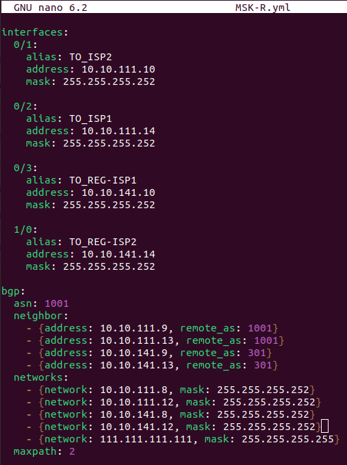

# Lab - Finish

## Цель:
   
   Организация удаленного доступа в сети предприятия с элементами автоматизации

## Описание/Пошаговая инструкция выполнения домашнего задания:

1. Подготовка устройств (руками)
2. Настройка интерфейсов (ansible)
3. Настройка VLAN и VPC  
4. BGP (ansible)
5. DMVPN (ansible)
   

## Topology


| Офис         | IPv4-сеть        |
|--------------|------------------|
| Москва       | 10.10.111.0/24 |
| (AS 1001)    |                  |
|--------------|------------------|
| Краснодар    | 10.10.121.0/24 |
| (AS 101)     |                  |
|--------------|------------------|
| Ростов       | 10.10.131.0/24 |
| (AS 201)     |                  |
|--------------|------------------|
| Региональные | 10.10.141.0/24 |
| провайдеры   |                  |
| (AS 301)     |                  |
|--------------|------------------|

Москва (AS 1001):
| Устройство | Порт | IP-адрес           | Описание     |
|------------|------|--------------------|--------------|
| MSK-R      | e0/0 | 10.10.40.111/24    | ANSIBLE_PORT |
|            | e0/1 | 10.10.111.10/30    | TO_ISP2      |
|            | e0/2 | 10.10.111.14/30    | TO_ISP1      |
|            | e0/3 | 10.10.141.10/30    | to_REG-ISP1  |
|            | e1/0 | 10.10.141.14/30    | to_REG-ISP2  |
|            | e1/1 | 10.10.111.34/30    | to_DC1       |
|            | e1/2 | 10.10.111.38/30    | to_DC2       |
|            | lo0  | 111.111.111.111/32 |              |
|------------|------|--------------------|--------------|
| ISP1       | e0/0 | 10.10.40.112       | ANSIBLE_PORT |
|            | e0/1 | 10.10.111.13/30    | TO_MSK-R     |
|            | e0/2 | 10.10.111.18/30    | TO_DC1       |
|            | e0/3 | 10.10.111.22/30    | TO_DC2       |
|            | lo0  | 112.112.112.112/32 |              |
|------------|------|--------------------|--------------|
| ISP2       | e0/0 | 10.10.40.113       | ANSIBLE_PORT |
|            | e0/1 | 10.10.111.9/30     | TO_MSK-R     |
|            | e0/2 | 10.10.111.26/30    | TO_DC1       |
|            | e0/3 | 10.10.111.30/30    | TO_DC2       |
|            | lo0  | 113.113.113.113/32 |              |
|------------|------|--------------------|--------------|
| DC1        | e0/0 | 10.10.40.114       | ANSIBLE_PORT |
|            | e0/1 | 10.10.111.17/30    | TO_ISP1      |
|            | e0/2 | 10.10.111.25/30    | TO_ISP2      |
|            | e1/0 | 10.10.111.33/30    | TO_MSK-R     |
|            | lo0  | 114.114.114.114/32 |              |
|------------|------|--------------------|--------------|
| DC2        | e0/0 | 10.10.40.115       | ANSIBLE_PORT |
|            | e0/1 | 10.10.111.21/30    | TO_ISP1      |
|            | e0/2 | 10.10.111.29/30    | TO_ISP2      |
|            | e1/0 | 10.10.111.37/30    | TO_MSK-R     |
|            | lo0  | 115.115.115.115/32 |              |
|------------|------|--------------------|--------------|

Краснодар(AS101)
| Устройство | Порт | IP-адрес           | Описание     |
|------------|------|--------------------|--------------|
| KRD-R1     | e0/0 | 10.10.40.121       | ANSIBLE_PORT |
|            | e0/1 | 10.10.141.17/30    | TO_REG-ISP1  |
|            | e0/2 | 10.10.141.29/30    | TO_REG_ISP2  |
|            | e0/3 | 10.10.121.10/30    | TO_ANAPA-R   |
|            | e1/0 | 10.10.121.14/30    | TO_SOCHI-R   |
|            | e1/1 | 10.10.121.18/30    | TO_NVRSK-R   |
|            | lo0  | 121.121.121.121/32 |              |
|------------|------|--------------------|--------------|
| ANAPA-R    | e0/0 | 10.10.40.122       | ANSIBLE_PORT |
|            | e0/1 | 10.10.121.9/30     | TO_KRD-R1    |
|            | lo0  | 122.122.122.122/32 |              |
|------------|------|--------------------|--------------|
| SOCHI-R    | e0/0 | 10.10.40.123       | ANSIBLE_PORT |
|            | e0/1 | 10.10.121.13/30    | TO_KRD-R1    |
|            | lo0  | 123.123.123.123/32 |              |
|------------|------|--------------------|--------------|
| NVRSK-R    | e0/0 | 10.10.40.124       | ANSIBLE_PORT |
|            | e0/1 | 10.10.121.17/30    | TO_KRD-R1    |
|            | lo0  | 124.124.124.124/32 |              |
|------------|------|--------------------|--------------|


Ростов (AS 1001)
| Устройство | Порт | IP-адрес           | Описание     |
|------------|------|--------------------|--------------|
| RSTV-R1    | e0/0 | 10.10.40.131       | ANSIBLE_PORT |
|            | e0/1 | 10.10.141.21/30    | TO_REG-ISP1  |
|            | e0/2 | 10.10.141.33/30    | TO_REG-ISP2  |
|            | e0/3 | 10.10.131.10/30    | TO_AZOV-R    |
|            | e1/0 | 10.10.131.14/30    | TO_TAGANROG-R|
|            | e1/1 | 10.10.131.18/30    | TO_NVCHRKSK-R|
|            | lo0  | 131.131.131.131/32 |              |
|------------|------|--------------------|--------------|
| AZOV-R     | e0/0 | 10.10.40.132       | ANSIBLE_PORT |
|            | e0/1 | 10.10.131.9/30     | TO_RSTV-R1   |
|            | lo0  | 132.132.132.132/32 |              |
|------------|------|--------------------|--------------|
| TAGANROG-R | e0/0 | 10.10.40.133       | ANSIBLE_PORT |
|            | e0/1 | 10.10.131.13/30    | TO_RSTV-R1   |
|            | lo0  | 133.133.133.133/32 |              |      |------------|------|--------------------|--------------|
| NVCHRKSK-R | e0/0 | 10.10.40.134       | ANSIBLE_PORT |
|            | e0/1 | 10.10.131.17/30    | TO_RSTV-R1   |
|            | lo0  | 134.134.134.134/32 |              |
|------------|------|--------------------|--------------|

Региональные провайдеры (AS 301)
| Устройство | Порт | IP-адрес           | Описание     |
|------------|------|--------------------|--------------|
| REG-ISP1   | e0/0 | 10.10.40.141       | ANSIBLE_PORT |
|            | e0/1 | 10.10.141.9/30     | TO_MSK-R     |
|            | e0/2 | 10.10.141.18/30    | TO_KRD-R1    |
|            | e0/3 | 10.10.141.22/30    | TO_RSTV-R1   |
|            | e1/0 | 10.10.141.26/30    | TO_REG-ISP2  |
|            | lo0  | 141.141.141.141/32 |              |
|------------|------|--------------------|--------------|
| REG-ISP2   | e0/0 | 10.10.40.142       | ANSIBLE_PORT |
|            | e0/1 | 10.16.1.13/30      | TO-MSK-R     |
|            | e0/2 | 10.10.141.30/30    | TO_KRD-R1    |
|            | e0/3 | 10.10.141.34/30    | TO_RSTV-R1   |
|            | e1/0 | 10.10.141.25/30    | TO_REG-ISP1  |
|            | lo0  | 142.142.142.142/30 |              |
|------------|------|--------------------|--------------|

1. Вручную настраиваем на маршрутизаторах ip-адрес и имя хоста для подключения ansible:

```
Router>
Router#conf t
Router(config)#no service config
Router(config)#hostname DC1
DC1(config)#int e0/0
DC1(config-if)#description ANSIBLE_PORT
DC1(config-if)#ip addr 10.10.40.114 255.255.255.0
DC1(config-if)#no shut
DC1(config-if)#exit
DC1(config)#ip domain-name pogodin.online
DC1(config)#crypto key generate rsa mod 2048
DC1(config)#ip ssh ver 2
DC1(config)#username admin secret admin
DC1(config)#username admin priv 15
DC1(config)#line vty 0 4
DC1(config-line)#login local
DC1(config-line)#transport input ssh
DC1(config-line)#end
DC1#wr
```

2. Создаем для каждого маршрутизатора файл с настройками интерфесов


   и шаблон для ansible


3. Конфигурируем субинтерфейсы на маршрутизоторах и vlans на коммутаторах


  
   вручную добавляем адреса на vpcs
   


   шаблоны:


   


4. Добавляем в файлы с настройками маршрутизатора конфигурации BGP


   
   и соответствующий шаблон для ansible
   


