# Lab - Configure Router-on-a-Stick Inter-VLAN Routing

## Topology

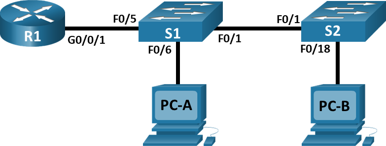

## Addressing Table

| Device | Interface | IP Address    | Subnet Mask   | Default Gateway |
| ------ |:---------:|:-------------:|:-------------:|:---------------:|
| R1     | e0/0.3    | 192.168.3.1   | 255.255.255.0 | N/A             |
|        | e0/0.4    | 192.168.4.1   | 255.255.255.0 |                 |
|        | e0/0.8    | N/A           |               |                 |
| S1     | VLAN 3    | 192.168.3.11  | 255.255.255.0 | 192.168.3.1     |
| S2     | VLAN 3    | 192.168.3.12  | 255.255.255.0 | 192.168.3.1     |
| PC-A   | NIC       | 192.168.3.3   | 255.255.255.0 | 192.168.3.1     |
| PC-B   | NIC       | 192.168.4.3   | 255.255.255.0 | 192.168.4.1     |

## VLAN Table

| VLAN | Name        | Interface Assigned |
| ---- | ----------- | -------------------|
| 3    | Management  | S1: VLAN 3         |
|      |             | S2: VLAN 3         |
|      |             | S1: e0/1           | 
| 4    | Operations  | S2: e0/1           |
| 7    | Parking_Lot | unused interfaces  |
| 8    | Native      | N/A                |

## Part 1. Build the Network and Configure Basic Device Settings

### Step 1. Cable the network as shown in the topology.

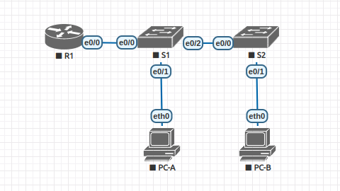

### Step 2: Configure basic settings for the router.
   a. Console into the router and enable privileged EXEC mode.

   b. Enter configuration mode.

   c. Assign a device name to the router.

   d. Disable DNS lookup to prevent the router from attempting to translate incorrectly entered commands as
though they were host names.

   e. Assign ```class``` as the privileged EXEC encrypted password.

   f. Assign ```cisco``` as the console password and enable login.

   g. Assign ```cisco``` as the VTY password and enable login.

   h. Encrypt the plaintext passwords.

   i. Create a banner that warns anyone accessing the device that unauthorized access is prohibited.

   j. Save the running configuration to the startup configuration file.

   k. Set the clock on the router.

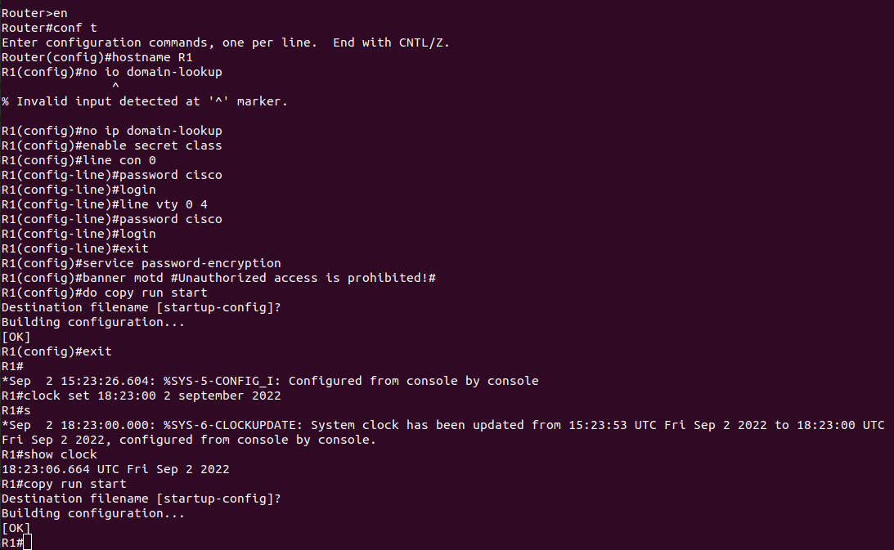

### Step 3: Configure basic settings for each switch.

   a. Console into the switch and enable privileged EXEC mode.
   
   b. Enter configuration mode.
   
   c. Assign a device name to the switch.
   
   d. Disable DNS lookup to prevent the router from attempting to translate incorrectly entered commands as
though they were host names.

   e. Assign ```class``` as the privileged EXEC encrypted password.
   
   f. Assign ```cisco``` as the console password and enable login.
     
   g. Assign ```cisco``` as the vty password and enable login.
   
   h. Encrypt the plaintext passwords.
   
   i. Create a banner that warns anyone accessing the device that unauthorized access is prohibited.
   
   j. Set the clock on the switch.

   k. Copy the running configuration to the startup configuration.

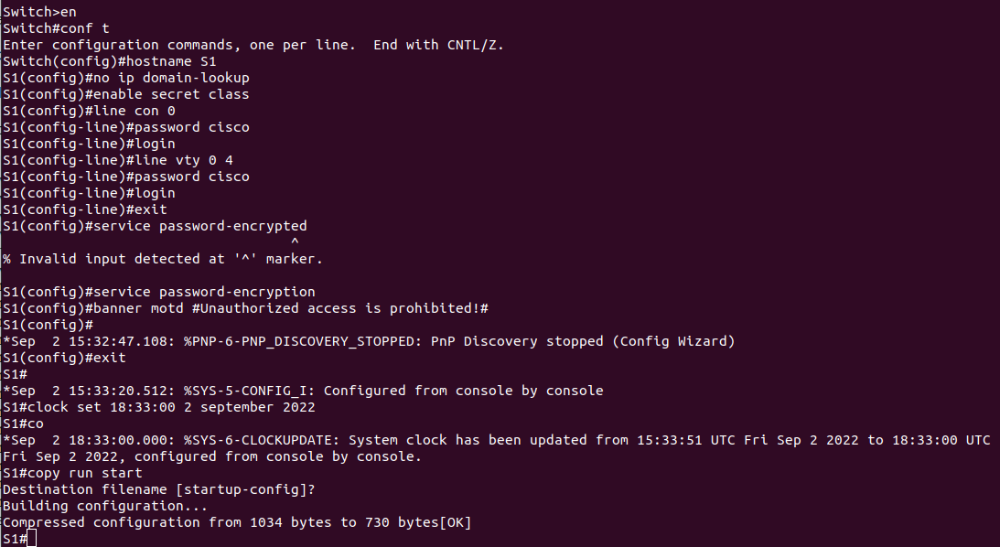

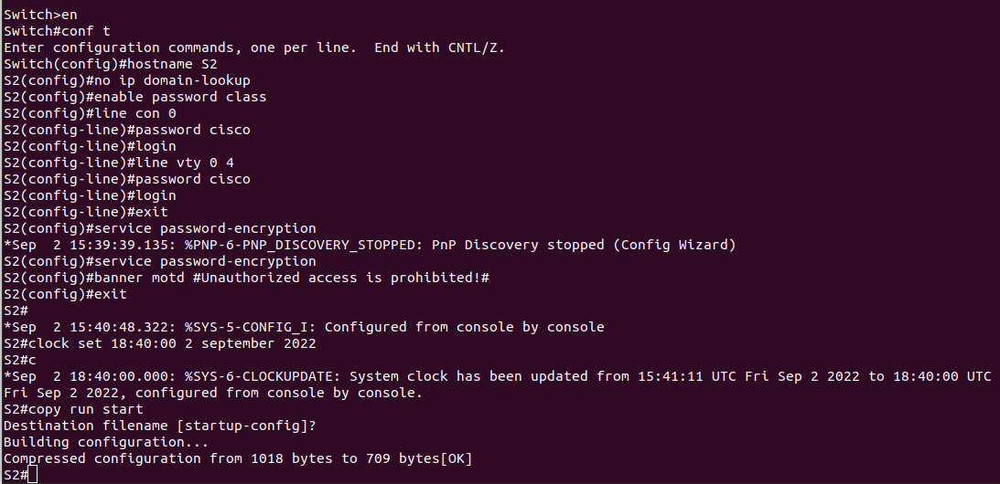

### Step 4: Configure PC hosts.

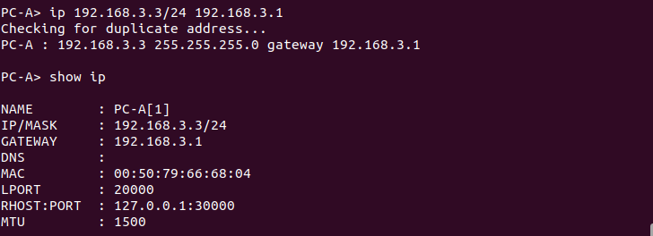

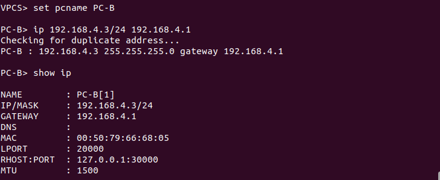

## Part 2. Create VLANs and Assign Switch Ports

### Step 1: Create VLANs on both switches.

   a. Create and name the required VLANs on each switch from the table above.
   
   b. Configure the management interface and default gateway on each switch using the
IP address information in the Addressing Table. 

   c. Assign all unused ports on both switches to the ParkingLot VLAN, configure them
for static access mode, and administratively deactivate them.

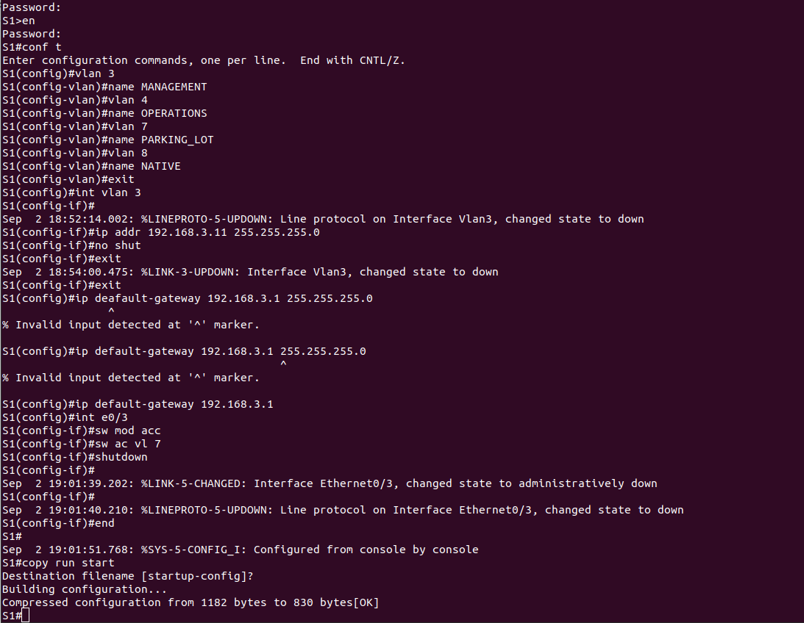


### Step 2: Assign VLANs to the correct switch interfaces.

   a. Assign used ports to the appropriate VLAN (specified in the VLAN table above) and configure
them for static access mode. Be sure to do this on both switches

   b. Issue the ```show vlan brief``` command and verify that the VLANs are assigned to the correct interfaces.
   
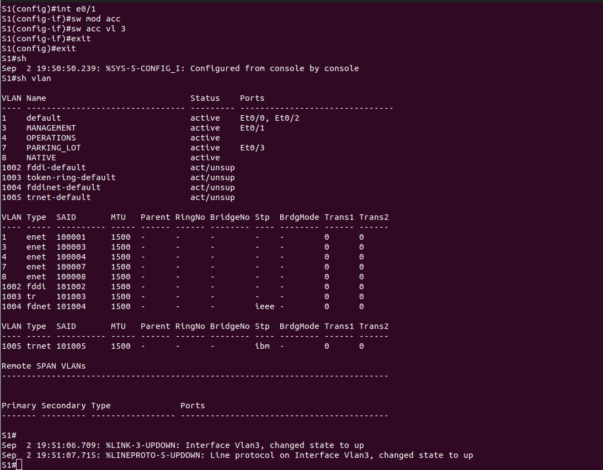

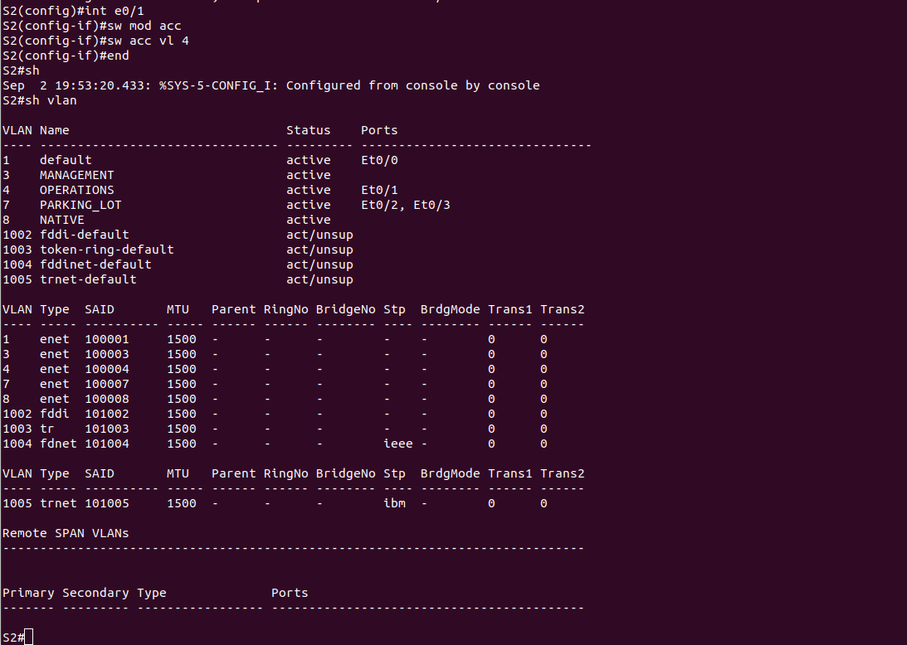

## Part 3. Configure an 802.1Q Trunk Between the Switches

### Step 1: Manually configure trunk interface F0/1.

   a. Change the switchport mode on interface F0/1 to force trunking. Make sure to do this on both switches.
   
   b. As a part of the trunk configuration, set the native VLAN to 8 on both switches. You may see error
messages temporarily while the two interfaces are configured for different native VLANs.

   c. As another part of trunk configuration, specify that VLANs 3, 4, and 8 are only allowed to cross the trunk.
   
   d. Issue the ```show interfaces trunk``` command to verify trunking ports, the Native VLAN and allowed VLANs across the trunk.
   
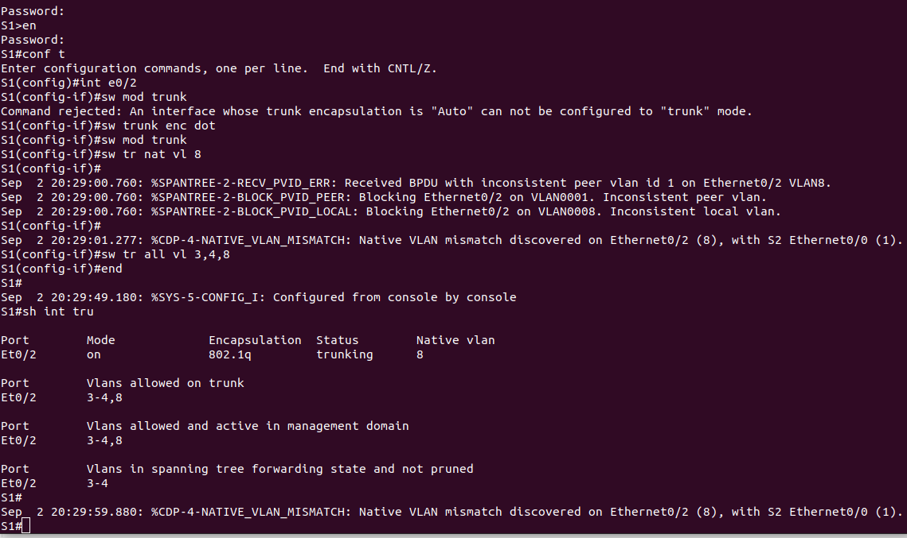

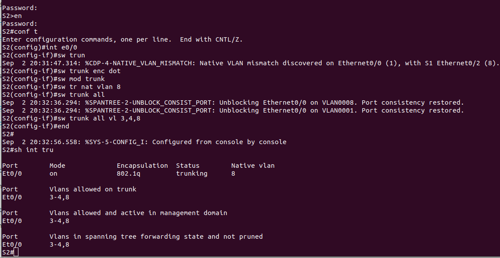

### Step 2: Manually configure S1’s trunk interface F0/5
   a. Configure the F0/5 on S1 with the same trunk parameters as F0/1. This is the trunk to the router.
   
   b. Save the running configuration to the startup configuration file on S1 and S2.
   
   c. Issue the ```show interfaces trunk``` command to verify trunking.

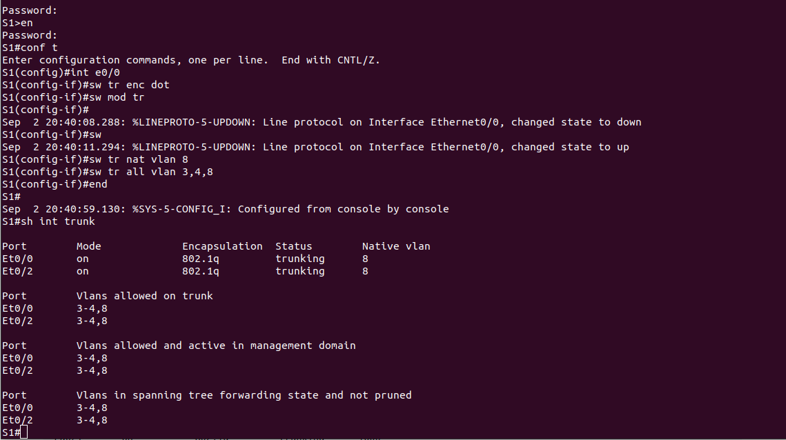

Question:

   Why does F0/5 not appear in the list of trunks?
   
```
На другом конце - роутер, у которго интерфейс выключен и не назначен тип - access или trunk.
```

## Part 4: Configure Inter-VLAN Routing on the Router

   a. Activate interface G0/0/1 on the router.
   
   b. Configure sub-interfaces for each VLAN as specified in the IP addressing table. All sub-interfaces use
802.1Q encapsulation. Ensure the sub-interface for the native VLAN does not have an IP address assigned. 
Include a description for each sub-interface.

   c. Use the ```show ip interface brief``` command to verify the sub-interfaces are operational.
   
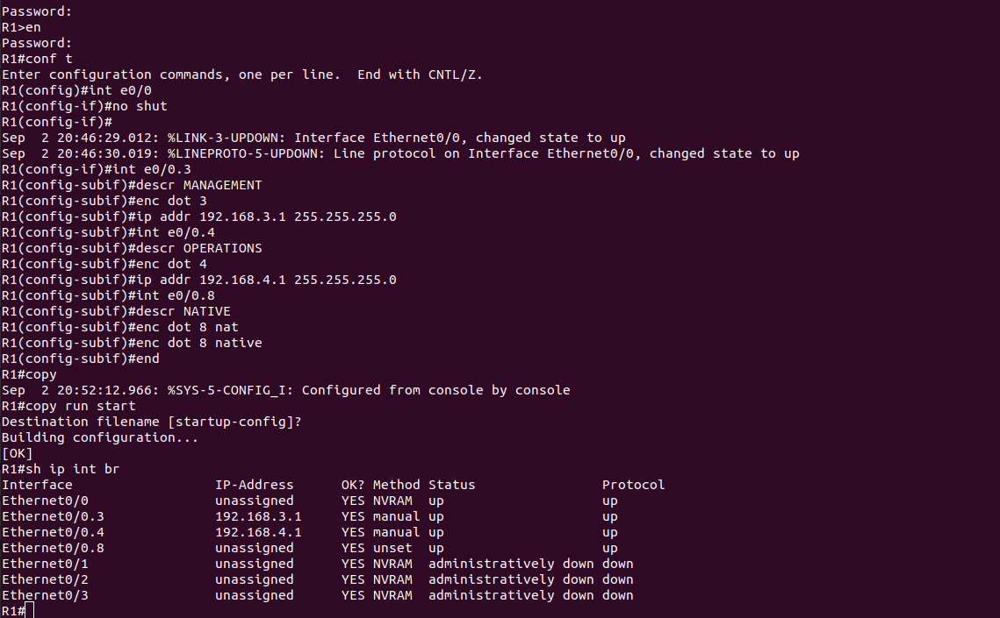


### Step 1: Complete the following tests from PC-A. All should be successful.

   Note: You may have to disable the PC firewall for pings to be successful.
   
   a. Ping from PC-A to its default gateway.
   
   b. Ping from PC-A to PC-B
   
   c. Ping from PC-A to S2

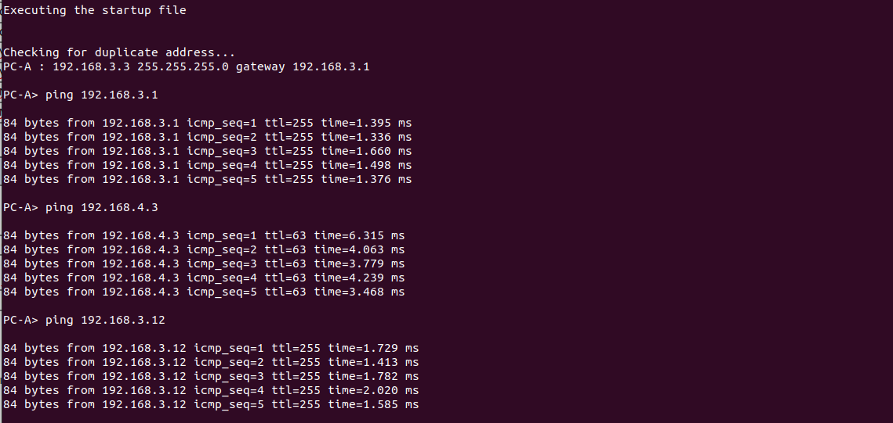

### Step 2: Complete the following test from PC-B.

   From the command prompt on PC-B, issue the tracert command to the address of PC-A.
   
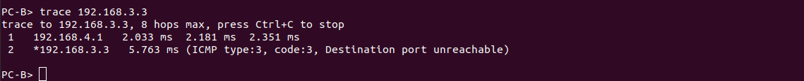
   
Question:

   What intermediate IP addresses are shown in the results?

```
192.168.4.1 - шлюз для VLAN 4
192.168.3.3 - ip-адрес PC-A
```

