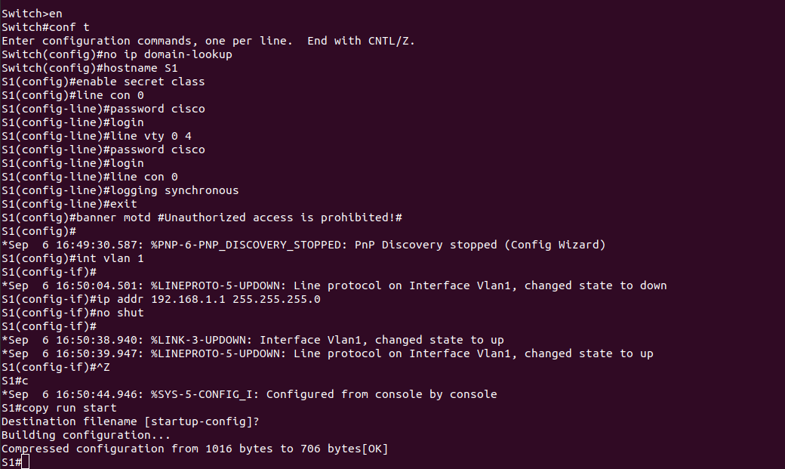
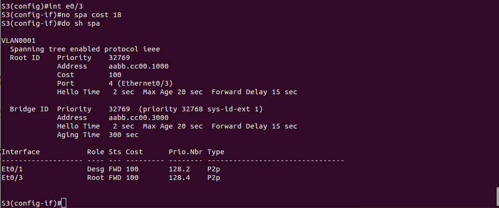
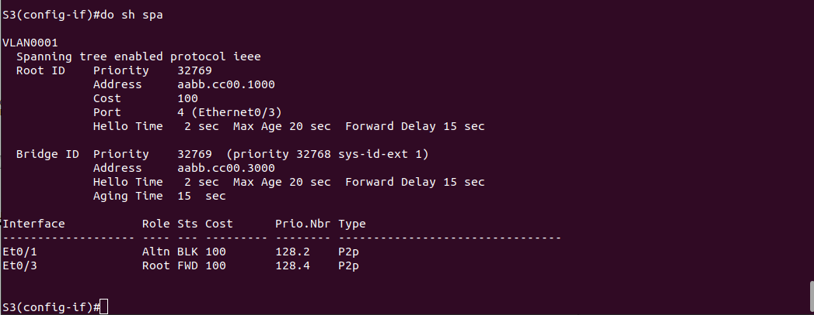

# Лабораторная работа. Развертывание коммутируемой сети с резервными каналами

## Топология


## Таблица адресации

| Устройство | Интерфейс | IP-адрес      | Маска подсети |
| ---------- |:---------:|:-------------:|:-------------:|
| S1         | VLAN 1    | 192.168.1.1   | 255.255.255.0 |
| S2         | VLAN 1    | 192.168.1.2   | 255.255.255.0 |
| S3         | VLAN 1    | 192.168.1.3   | 255.255.255.0 |

## Создание сети и настройка основных параметров устройства

### Шаг 1. Создайте сеть согласно топологии.


### Шаг 2. Выполните инициализацию и перезагрузку коммутаторов.
   


### Шаг 3. Настройте базовые параметры каждого коммутатора.

   a. Отключите поиск DNS.
   
   b. Присвойте имена устройствам в соответствии с топологией.
   
   c. Назначьте ```class``` в качестве зашифрованного пароля доступа к привилегированному режиму.
   
   d. Назначьте ```cisco``` в качестве паролей консоли и VTY и активируйте вход для консоли и VTY каналов.
   
   e. Настройте ```logging synchronous``` для консольного канала.
   
   f. Настройте баннерное сообщение дня (MOTD) для предупреждения пользователей о запрете несанкционированного доступа.
   
   g. Задайте IP-адрес, указанный в таблице адресации для VLAN 1 на всех коммутаторах.
   
   h. Скопируйте текущую конфигурацию в файл загрузочной конфигурации.




```
При настройке третьего коммутатора опечатался, ввел 192.168.3.1. Поправил.
```

### Шаг 4: Проверьте связь.

   Успешно ли выполняется эхо-запрос от коммутатора S1 на коммутатор S2?


   
   Успешно ли выполняется эхо-запрос от коммутатора S1 на коммутатор S3?
   

   
   Успешно ли выполняется эхо-запрос от коммутатора S2 на коммутатор S3?


## Часть 2. Определение корневого моста

### Шаг 1: Отключите все порты на коммутаторах.

### Шаг 2: Настройте подключенные порты в качестве транковых.


### Шаг 3: Включите порты e0/1 и e0/3 на всех коммутаторах.


### Шаг 4: Отобразите данные протокола spanning-tree.


   С учетом выходных данных, поступающих с коммутаторов, ответьте на следующие вопросы.
   

  
   Какой коммутатор является корневым мостом?

```
Коммутатор S1
```

   Почему этот коммутатор был выбран протоколом spanning-tree в качестве корневого моста?

```
У него минимальный MAC-адрес по сравнению с S2 и S3
```

   Какие порты на коммутаторе являются корневыми портами?
   
```
На S2 - e0/1, на S3 - e0/3
```
   
   Какие порты на коммутаторе являются назначенными портами?
   
```
На S1 - e0/1 и e0/3, на S2 - e0/3
```   
   
   Какой порт отображается в качестве альтернативного и в настоящее время заблокирован?
   
```
Порт e0/1 на коммутаторе S3
```   
   
   Почему протокол spanning-tree выбрал этот порт в качестве невыделенного (заблокированного) порта?
   
```
У коммутатора S2 MAC адрес меньше, чем у S3 и напротив назначенный порт, а не корневой.
```

## Часть 3: Наблюдение за процессом выбора протоколом STP порта, исходя из стоимости портов

### Шаг 1: Определите коммутатор с заблокированным портом.


### Шаг 2: Измените стоимость порта.


### Шаг 2: Просмотрите изменения протокола spanning-tree.


Почему протокол spanning-tree заменяет ранее заблокированный порт на назначенный порт и блокирует порт, 
который был назначенным портом на другом коммутаторе?

```
Потому, что стоимость заблокированного порта уменьшилась по сравнению со стоимостью назначенного.
```

### Шаг 3: Удалите изменения стоимости порта.





## Часть 4: Наблюдение за процессом выбора протоколом STP порта, исходя из приоритета портов

### Включите порты F0/1 и F0/3 на всех коммутаторах.


### Выполните команду show spanning-tree на коммутаторах некорневого моста


   Какой порт выбран протоколом STP в качестве порта корневого моста на каждом коммутаторе некорневого моста?
   
```
На S2 - e0/0, на S3 - e0/2
```   
   
   Почему протокол STP выбрал эти порты в качестве портов корневого моста на этих коммутаторах?
   
```
Они имеют минимальный номер порта среди портов, подключенных к корневому мосту
```

## Вопросы для повторения

   1. Какое значение протокол STP использует первым после выбора корневого моста, чтобы определить выбор порта?

```
Стоимость пути
```   

   2. Если первое значение на двух портах одинаково, какое следующее значение будет использовать протокол STP при выборе порта?
   
```
MAC-адрес коммутатора
```

   3. Если оба значения на двух портах равны, каким будет следующее значение, которое использует протокол STP при выборе порта?
   
```
Номер порта
```


