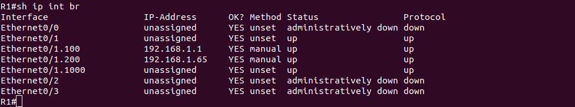

# Lab - Implement DHCPv4

## Topology


## Addressing Table

| Device | Interface | IP Address   | Subnet Mask     | Default Gateway |
|:-------|:----------|:------------:|:---------------:|:---------------:|
| R1     | e0/0      | 10.0.0.1     | 255.255.255.252 | N/A             |
|        | e0/1      | N/A          | N/A             | N/A             |
|        | e0/1.100  | 192.168.1.1  | 255.255.255.192 | N/A             |
|        | e0/1.200  | 192.168.1.65 | 255.255.255.224 | N/A             |
|        | e0/1.1000 | N/A          | N/A             | N/A             |
| R2     | e0/0      | 10.0.0.2     | 255.255.255.252 | N/A             |
|        | e0/1      | 192.168.1.97 | 255.255.255.240 | N/A             |
| S1     | VLAN 200  | 192.168.1.66 | 255.255.255.192 | 192.168.1.65    |
| S2     | VLAN 1    | 192.168.1.98 | 255.255.255.240 | 192.168.1.97    |
| PC-A   | NIC       | DHCP         | DHCP            | DHCP            |
| PC-B   | NIC       | DHCP         | DHCP            | DHCP            |

## VLAN Table
| VLAN	| Name	      | Interface Assigned |
|:------|:-----------:|:-------------------|
| 1     | N/A         | S2: e0/1           |
| 100   | Clients     | S1: e0/1           |
| 200   | Management  | S1: VLAN 200       |
| 999   | Parking_Lot | S1: e0/2-3         |
| 1000  | Native      | N/A                |

## Part 1: Build the Network and Configure Basic Device Settings


### Step 1: Establish an addressing scheme

   a. One subnet, “Subnet A”, supporting 58 hosts (the client VLAN at R1).
   
   Subnet A: 192.168.1.0/26
      
   b. One subnet, “Subnet B”, supporting 28 hosts (the management VLAN at R1). 
   
   Subnet B: 192.168.1.64/27
      
   c. One subnet, “Subnet C”, supporting 12 hosts (the client network at R2).
   
   Subnet C: 192.168.1.96/28

### Step 2: Cable the network as shown in the topology.


### Step 3: Configure basic settings for each router.

```
Router>enable
Router#configure terminal
Enter configuration commands, one per line.  End with CNTL/Z.
Router(config)#hostname R1
R1(config)#no ip domain-lookup
R1(config)#enable secret class
R1(config)#line con 0
R1(config-line)#password cisco
R1(config-line)#login
R1(config-line)#line vty 0 4
R1(config-line)#password cisco
R1(config-line)#login
R1(config-line)#exit
R1(config)#service password-encryption
R1(config)#banner motd #Unauthorized access is prohibited!#
R1(config)#exit
R1#
*Sep 13 04:11:10.822: %SYS-5-CONFIG_I: Configured from console by console
R1#clock set 07:11:00 13 september 2022
R1#
*Sep 13 07:11:00.000: %SYS-6-CLOCKUPDATE: System clock has been updated from 04:12:04 UTC Sat Sep 13 2022
to 07:11:00 UTC Tue Sep 13 2022, configured from console by console.
R1#copy run start
Destination filename [startup-config]? 
Building configuration...
[OK]
R1#
```

```
Router>enable
Router#configure terminal
Enter configuration commands, one per line.  End with CNTL/Z.
Router(config)#hostname R2
R2(config)#no ip domain-lookup
R2(config)#enable secret class
R2(config)#line con 0
R2(config-line)#password cisco
R2(config-line)#login
R2(config-line)#line vty 0 4
R2(config-line)#password cisco
R2(config-line)#login
R2(config-line)#exit
R2(config)#service password-encryption
R2(config)#banner motd #Unauthorized access is prohibited!#
R2(config)#exit
R2#
*Sep 13 04:18:07.695: %SYS-5-CONFIG_I: Configured from console by console
R2#clock set 07:18:00 13 september 2022
R2#cop
*Sep 13 07:18:00.000: %SYS-6-CLOCKUPDATE: System clock has been updated from 04:18:30 UTC Sat Sep 13 2022
to 07:18:00 UTC Tue Sep 13 2022, configured from console by console.
R2#copy run start
Destination filename [startup-config]? 
Building configuration...
[OK]
R2#
```

### Step 4: Configure Inter-VLAN Routing on R1   

```
R1#configure terminal    
Enter configuration commands, one per line.  End with CNTL/Z.
R1(config)#int e0/1
R1(config-if)#no shut
R1(config-if)#
Sep 13 07:24:09.881: %LINK-3-UPDOWN: Interface Ethernet0/1, changed state to up
Sep 13 07:24:10.890: %LINEPROTO-5-UPDOWN: Line protocol on Interface Ethernet0/1, changed state to up
R1(config-if)#exit
R1(config)#int e0/1.100
R1(config-subif)#des CLIENT
R1(config-subif)#enc dot 100
R1(config-subif)#ip addr 192.168.1.1 255.255.255.192
R1(config-subif)#int e0/1.200
R1(config-subif)#des MANAGEMENT
R1(config-subif)#enc dot 200
R1(config-subif)#ip addr 192.168.1.65 255.255.255.224
R1(config-subif)#int e0/1.1000
R1(config-subif)#des NATIVE
R1(config-subif)#enc dot 1000
R1(config-subif)#end
R1#c
Sep 13 07:27:45.588: %SYS-5-CONFIG_I: Configured from console by console
R1#copy run start
Destination filename [startup-config]? 
Building configuration...
[OK]
R1#
```



### Step 5: Configure e0/1 on R2, then e0/0 and static routing for both routers

```
R2#configure terminal
Enter configuration commands, one per line.  End with CNTL/Z.
R2(config)#int e0/1
R2(config-if)#ip addr 192.168.1.97 255.255.255.240
R2(config-if)#no shut
R2(config-if)#
Sep 13 07:34:36.098: %LINK-3-UPDOWN: Interface Ethernet0/1, changed state to up
Sep 13 07:34:37.104: %LINEPROTO-5-UPDOWN: Line protocol on Interface Ethernet0/1, changed state to up
R2(config-if)#int e0/0
R2(config-if)#ip addr 10.0.0.2 255.255.255.252
R2(config-if)#no shut
R2(config-if)#
Sep 13 07:35:14.093: %LINK-3-UPDOWN: Interface Ethernet0/0, changed state to up
Sep 13 07:35:15.100: %LINEPROTO-5-UPDOWN: Line protocol on Interface Ethernet0/0, changed state to up
R2(config-if)#exit
R2(config)#ip route 0.0.0.0 0.0.0.0 10.0.0.1
R2(config)#exit
R2#cop
Sep 13 07:35:45.038: %SYS-5-CONFIG_I: Configured from console by console
R2#copy run start
Destination filename [startup-config]? 
Building configuration...
[OK]
R2#
```

```
R1#conf t
Enter configuration commands, one per line.  End with CNTL/Z.
R1(config)#int e0/0
R1(config-if)#ip addr 10.0.0.1 255.255.255.252
R1(config-if)#no shut
R1(config-if)#
Sep 13 07:36:40.204: %LINK-3-UPDOWN: Interface Ethernet0/0, changed state to up
Sep 13 07:36:41.208: %LINEPROTO-5-UPDOWN: Line protocol on Interface Ethernet0/0, changed state to up
R1(config-if)#exit
R1(config)#ip route 0.0.0.0 0.0.0.0 10.0.0.2
R1(config)#exit
R1#cop
Sep 13 07:37:07.416: %SYS-5-CONFIG_I: Configured from console by console
R1#copy run start
Destination filename [startup-config]? 
Building configuration...
[OK]
R1#
```


### Step 6: Configure basic settings for each switch.

```
Switch>en
Switch#conf t
Enter configuration commands, one per line.  End with CNTL/Z.
Switch(config)#hostname S1
S1(config)#no ip domain-lookup
S1(config)#enable secret class
S1(config)#line con 0
S1(config-line)#password cisco
S1(config-line)#login
S1(config-line)#line vty 0 4
S1(config-line)#password cisco
S1(config-line)#login
S1(config-line)#exit
S1(config)#service password-encryption
S1(config)#banner motd ##
*Sep 10 06:16:21.378: %PNP-6-PNP_DISCOVERY_STOPPED: PnP Discovery stopped (Config Wizard)
S1(config)#banner motd #Unauthorized access is prohibited!#
S1(config)#exit
S1#cl
*Sep 13 06:16:44.751: %SYS-5-CONFIG_I: Configured from console by console
S1#clock set 09:16:00 13 september 2022
S1#
*Sep 13 09:16:00.000: %SYS-6-CLOCKUPDATE: System clock has been updated from 06:17:06 UTC Sat Sep 13 2022
to 09:16:00 UTC Tue Sep 13 2022, configured from console by console.
S1#copy run start
Destination filename [startup-config]? 
Building configuration...
Compressed configuration from 1036 bytes to 731 bytes[OK]
S1#
```

```
Switch>en
Switch#conf t
Enter configuration commands, one per line.  End with CNTL/Z.
Switch(config)#hostname S2
S2(config)#no ip domain-lookup
S2(config)#enable secret class
S2(config)#line con 0
S2(config-line)#password cisco
S2(config-line)#login
S2(config-line)#line vty 0 4
S2(config-line)#password cisco
S2(config-line)#login
S2(config-line)#exit
S2(config)#service password-encryption
S2(config)#banner motd #Unauthorized access is prohibited!#
S2(config)#exit
S2#c
*Sep 13 06:20:20.523: %SYS-5-CONFIG_I: Configured from console by console
S2#clock set 09:20:00 13 september 2022
S2#
*Sep 13 09:20:00.000: %SYS-6-CLOCKUPDATE: System clock has been updated from 06:20:37 UTC Sat Sep 13 2022 to
09:20:00 UTC Tue Sep 13 2022, configured from console by console.
S2#copy run start
Destination filename [startup-config]? 
Building configuration...
Compressed configuration from 1036 bytes to 734 bytes[OK]
S2#
```

### Step 7: Create VLANs on S1.

   a. Create and name the required VLANs on switch 1 from the table above.

```
S1#configure terminal
Enter configuration commands, one per line.  End with CNTL/Z.
S1(config)#vlan 100
S1(config-vlan)#name CLIENTS
S1(config-vlan)#vlan 200
S1(config-vlan)#name MANAGEMENT
S1(config-vlan)#vlan 999
S1(config-vlan)#name PARKING_LOT
S1(config-vlan)#vlan 1000
S1(config-vlan)#name NATIVE
S1(config-vlan)#do copy run start
Destination filename [startup-config]? 
Building configuration...
Compressed configuration from 1036 bytes to 736 bytes[OK]
S1(config-vlan)#
```

   b. Configure and activate the management interface on S1 (VLAN 200) using the second IP address from the subnet calculated
earlier. Additionally, set the default gateway on S1.

```
S1(config)#int vlan 200
S1(config-if)#ip
Sep 13 09:33:46.331: %LINEPROTO-5-UPDOWN: Line protocol on Interface Vlan200, changed state to down
S1(config-if)#ip addr 192.168.1.66 255.255.255.224
S1(config-if)#no shut
S1(config-if)#exit
Sep 13 09:34:15.997: %LINK-3-UPDOWN: Interface Vlan200, changed state to down
S1(config)#ip default-gateway 192.168.1.65
S1(config)#do copy run start 
Destination filename [startup-config]? 
Building configuration...
Compressed configuration from 1129 bytes to 791 bytes[OK]
S1(config)#
```

   c. Configure and activate the management interface on S2 (VLAN 1) using the second IP address from the subnet calculated
earlier. Additionally, set the default gateway on S2

```
S2#configure terminal
Enter configuration commands, one per line.  End with CNTL/Z.
S2(config)#int vlan 1
S2(config-if)#ip 
Sep 13 09:38:16.318: %LINEPROTO-5-UPDOWN: Line protocol on Interface Vlan1, changed state to down
S2(config-if)#ip addr 192.168.1.98 255.255.255.240
S2(config-if)#no shut
S2(config-if)#exit
S2(config)#
Sep 13 09:38:44.011: %LINK-3-UPDOWN: Interface Vlan1, changed state to up
Sep 13 09:38:45.016: %LINEPROTO-5-UPDOWN: Line protocol on Interface Vlan1, changed state to up
S2(config)#ip default-gateway 192.168.1.97
S2(config)#
```

   d. Assign all unused ports on S1 to the Parking_Lot VLAN, configure them for static access mode, and administratively
deactivate them. On S2, administratively deactivate all the unused ports.

```
S1(config)#int range e0/2-3
S1(config-if-range)#switchport mode access
S1(config-if-range)#switchport access vlan 999
S1(config-if-range)#shut
S1(config-if-range)#
Sep 13 09:45:02.286: %LINK-5-CHANGED: Interface Ethernet0/2, changed state to administratively down
Sep 13 09:45:02.295: %LINK-5-CHANGED: Interface Ethernet0/3, changed state to administratively down
Sep 13 09:45:03.292: %LINEPROTO-5-UPDOWN: Line protocol on Interface Ethernet0/2, changed state to down
Sep 13 09:45:03.301: %LINEPROTO-5-UPDOWN: Line protocol on Interface Ethernet0/3, changed state to down
S1(config-if-range)#exit
S1(config)#exit
S1#d
Sep 13 09:45:18.588: %SYS-5-CONFIG_I: Configured from console by console
S1#copy run start
Destination filename [startup-config]? 
Building configuration...
Compressed configuration from 1253 bytes to 860 bytes[OK]
S1#
```

```
S2(config)#int range e0/2-3
S2(config-if-range)#shut
S2(config-if-range)#
Sep 13 09:48:11.473: %LINK-5-CHANGED: Interface Ethernet0/2, changed state to administratively down
Sep 13 09:48:11.473: %LINK-5-CHANGED: Interface Ethernet0/3, changed state to administratively down
Sep 13 09:48:12.482: %LINEPROTO-5-UPDOWN: Line protocol on Interface Ethernet0/2, changed state to down
Sep 13 09:48:12.482: %LINEPROTO-5-UPDOWN: Line protocol on Interface Ethernet0/3, changed state to down
S2(config-if-range)#end
S2#cop
Sep 13 09:48:16.787: %SYS-5-CONFIG_I: Configured from console by console
S2#copy run start
Destination filename [startup-config]? 
Building configuration...
Compressed configuration from 1147 bytes to 811 bytes[OK]
S2#
```

### Step 8: Assign VLANs to the correct switch interfaces.

```
S1(config)#int e0/1
S1(config-if)#switchport mode access
S1(config-if)#switchport access vlan 100
S1(config-if)#end
S1#c
Sep 13 10:03:58.389: %SYS-5-CONFIG_I: Configured from console by console
S1#copy run start
Destination filename [startup-config]? 
Building configuration...
Compressed configuration from 1305 bytes to 879 bytes[OK]
S1#
```


Why is interface e0/0 listed under VLAN 1?

```
Данный интерфейс еще не настроен, поэтому находится в дефолтном влане.
```

### Step 9: Manually configure S1’s interface F0/5 as an 802.1Q trunk.

```
S1(config)#int e0/0
S1(config-if)#switchport trunk enc dot
S1(config-if)#switchport mode trunk
S1(config-if)#switc
Sep 13 10:11:04.381: %LINEPROTO-5-UPDOWN: Line protocol on Interface Ethernet0/0, changed state to down
S1(config-if)#switchport 
Sep 13 10:11:07.393: %LINEPROTO-5-UPDOWN: Line protocol on Interface Ethernet0/0, changed state to up
S1(config-if)#switchport trunk native vlan 1000
S1(config-if)#switchport trunk allowed vlan 
Sep 13 10:11:38.410: %LINK-3-UPDOWN: Interface Vlan200, changed state to up
Sep 13 10:11:39.416: %LINEPROTO-5-UPDOWN: Line protocol on Interface Vlan200, changed state to up
S1(config-if)#switchport trunk allowed vlan 100,200,1000
S1(config-if)#end
S1#co
Sep 13 10:11:59.486: %SYS-5-CONFIG_I: Configured from console by console
S1#copy run start
Destination filename [startup-config]? 
Building configuration...
Compressed configuration from 1445 bytes to 953 bytes[OK]
S1#
```


   At this point, what IP address would the PC’s have if they were connected to the network using DHCP?
   
```
Так как DHCP еще не настроен, то PC-A и PC-B получат адреса из диапазона 169.254.0.0/16.
```

## Part 2: Configure and verify two DHCPv4 Servers on R1

### Step 1-2: Configure R1 with DHCPv4 pools for the two supported subnets. Only the DHCP Pool for subnet A is given below

```
R1#conf t
Enter configuration commands, one per line.  End with CNTL/Z.
R1(config)#ip dhcp excluded-address 192.168.1.1 192.168.1.5
R1(config)#ip dhcp pool R1_CLIENTS
R1(dhcp-config)#network 192.168.1.0 255.255.255.192
R1(dhcp-config)#domain-name otus.network           
R1(dhcp-config)#default-router 192.168.1.1         
R1(dhcp-config)#lease 2 12 30
R1(dhcp-config)#exit
R1(config)#ip dhcp excluded-address 192.168.1.97 192.168.1.101
R1(config)#ip dhcp pool R2_CLIENTS
R1(dhcp-config)#network 192.168.1.96 255.255.255.240
R1(dhcp-config)#domain-name otus.network
R1(dhcp-config)#default-router 192.168.1.97
R1(dhcp-config)#lease 2 12 30
R1(dhcp-config)#end
R1#
Sep 13 10:41:50.309: %SYS-5-CONFIG_I: Configured from console by console
R1#copy run start
Destination filename [startup-config]? 
Building configuration...
[OK]
R1#
```

### Step 3: Verify the DHCPv4 Server configuration


### Step 4: Attempt to acquire an IP address from DHCP on PC-A


## Part 3: Configure and verify a DHCP Relay on R2

### Step 1: Configure R2 as a DHCP relay agent for the LAN on G0/0/1

```
R2#conf t
Enter configuration commands, one per line.  End with CNTL/Z.
R2(config)#int e0/1
R2(config-if)#ip helper-address 10.0.0.1
R2(config-if)#end
R2#co
Sep 13 11:02:31.367: %SYS-5-CONFIG_I: Configured from console by console
R2#copy run start
Destination filename [startup-config]? 
Building configuration...
[OK]
R2#
```

### Step 2: Attempt to acquire an IP address from DHCP on PC-B


