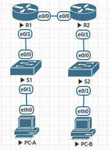
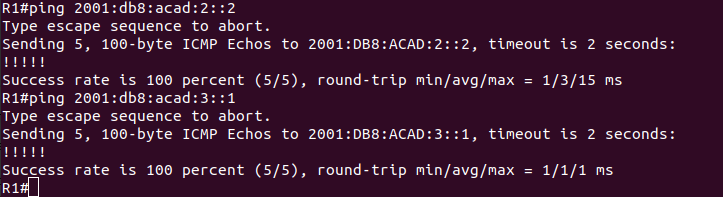
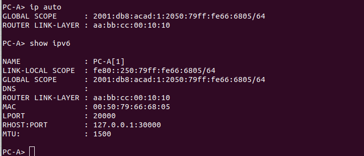
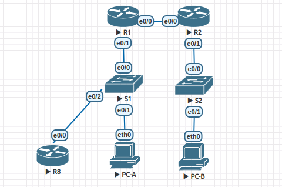
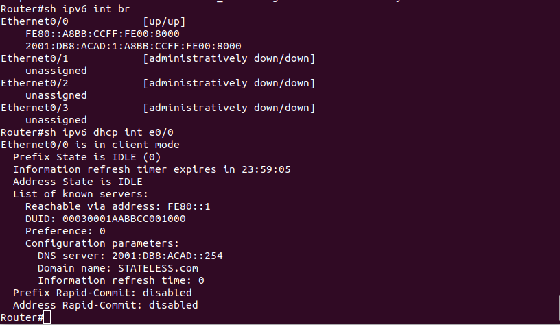
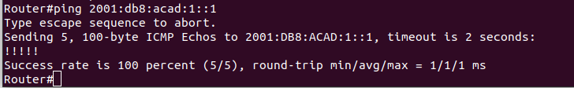
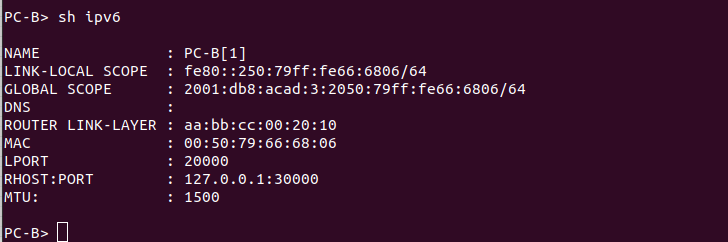
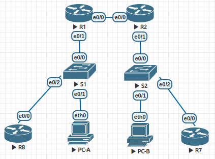
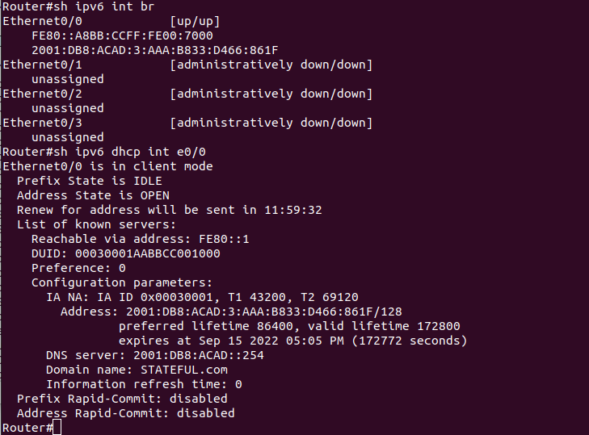
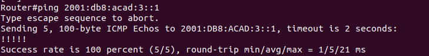

# Lab - Configure DHCPv6

## Topology


## Addressing Table

| Device | Interface | IPv6 Address          |
|:-------|:----------|:---------------------:|
| R1     | e0/0      | 2001:db8:acad:2::1/64 |
|        |           | fe80::1               |
|        | e0/1      | 2001:db8:acad:1::1/64 |
|        |           | fe80::1               |
| R2     | e0/0      | 2001:db8:acad:2::2/64 |
|        |           | fe80::2               |  
|        | e0/1      | 2001:db8:acad:3::1/64 |
|        |           | fe80::1               |
| PC-A   | NIC       | DHCP                  |
| PC-B   | NIC       | DHCP                  |

## Part 1: Build the Network and Configure Basic Device Settings

### Step 1: Cable the network as shown in the topology.



### Step 2: Configure basic settings for each switch. (Optional)

```
Switch>en
Switch#conf t
Enter configuration commands, one per line.  End with CNTL/Z.
Switch(config)#hostname S1
S1(config)#no ip domain-lookup
S1(config)#enable secret class
S1(config)#line con 0
S1(config-line)#password cisco
S1(config-line)#login
S1(config-line)#line vty 0 4
S1(config-line)#password cisco
S1(config-line)#login
S1(config-line)#exit
S1(config)#service password-encryption 
S1(config)#banner motd #Unauthorized access is prohibited!#
S1(config)#int range e0/2-3
S1(config-if-range)#shut
S1(config-if-range)#
*Sep 13 10:33:18.185: %LINK-5-CHANGED: Interface Ethernet0/2, changed state to administratively down
*Sep 13 10:33:18.186: %LINK-5-CHANGED: Interface Ethernet0/3, changed state to administratively down
*Sep 13 10:33:19.191: %LINEPROTO-5-UPDOWN: Line protocol on Interface Ethernet0/2, changed state to down
*Sep 13 10:33:19.191: %LINEPROTO-5-UPDOWN: Line protocol on Interface Ethernet0/3, changed state to down
S1(config-if-range)#end
S1#cop
*Sep 13 10:33:34.679: %SYS-5-CONFIG_I: Configured from console by console
S1#copy run start
Destination filename [startup-config]? 
Building configuration...
Compressed configuration from 996 bytes to 713 bytes[OK]
S1#
```

```
Switch>en
Switch#conf t
Enter configuration commands, one per line.  End with CNTL/Z.
Switch(config)#hostname S2
S2(config)#no ip domain-lookup
S2(config)#
*Sep 13 10:35:21.531: %PNP-6-PNP_DISCOVERY_STOPPED: PnP Discovery stopped (Config Wizard)
S2(config)#enable secret class
S2(config)#line con 0
S2(config-line)#password cisco
S2(config-line)#login
S2(config-line)#line vty 0 4
S2(config-line)#password cisco
S2(config-line)#login
S2(config-line)#exit
S2(config)#service password-encryption
S2(config)#banner motd #Unauthorized access is prohibited!#
S2(config)#int range e0/2-3
S2(config-if-range)#shut
S2(config-if-range)#end
S1#
*Sep 13 10:36:53.728: %LINK-5-CHANGED: Interface Ethernet0/2, changed state to administratively down
*Sep 13 10:36:53.728: %LINK-5-CHANGED: Interface Ethernet0/3, changed state to administratively down
*Sep 13 10:36:54.156: %SYS-5-CONFIG_I: Configured from console by console
*Sep 13 10:36:54.732: %LINEPROTO-5-UPDOWN: Line protocol on Interface Ethernet0/2, changed state to down
*Sep 13 10:36:54.732: %LINEPROTO-5-UPDOWN: Line protocol on Interface Ethernet0/3, changed state to down
S2#copy run start
Destination filename [startup-config]? 
Building configuration...
Compressed configuration from 996 bytes to 713 bytes[OK]
S2#
```

### Step 3: Configure basic settings for each router.

```
Router>en
Router#conf t
Enter configuration commands, one per line.  End with CNTL/Z.
Router(config)#hostname R1
R1(config)#no ip domain-lookup
R1(config)#enable secret class
R1(config)#line con 0
R1(config-line)#password cisco
R1(config-line)#login
R1(config-line)#line vty 0 4
R1(config-line)#passw
*Sep 13 10:40:46.845: %PNP-6-PNP_DISCOVERY_STOPPED: PnP Discovery stopped (Config Wizard)
R1(config-line)#password cisco
R1(config-line)#login
R1(config-line)#exit
R1(config)#service password-encryption
R1(config)#banner motd #Unauthorized access is prohibited!#
R1(config)#ipv6 unicast-routing
R1(config)#end
R1#cop
*Sep 13 10:42:41.305: %SYS-5-CONFIG_I: Configured from console by console
R1#copy run start
Destination filename [startup-config]? 
Building configuration...
[OK]
R1#
```

```
Router>en
Router#conf
*Sep 13 10:44:57.578: %PNP-6-PNP_DISCOVERY_STOPPED: PnP Discovery stopped (Config Wizard)
Router#conf t
Enter configuration commands, one per line.  End with CNTL/Z.
Router(config)#hostname R2
R2(config)#no ip domain-lookup
R2(config)#enable secret class
R2(config)#line con 0
R2(config-line)#password cisco
R2(config-line)#login
R2(config-line)#line vty 0 4
R2(config-line)#password cisco
R2(config-line)#login
R2(config-line)#exit
R2(config)#service password-encryption
R2(config)#banner motd #Unauthorized access is prohibited!#
R2(config)#ipv6 unicast-routing
R2(config)#^Z
R2#
*Sep 13 10:46:53.720: %SYS-5-CONFIG_I: Configured from console by console
R2#copy run start
Destination filename [startup-config]? 
Building configuration...
[OK]
R2#
```

### Step 4: Configure interfaces and routing for both routers.

```
R1#conf t
Enter configuration commands, one per line.  End with CNTL/Z.
R1(config)#int e0/0
R1(config-if)#ipv6 addr fe80::1 link-local
R1(config-if)#ipv6 addr 2001:db8:acad:2::1/64
R1(config-if)#no shut
R1(config-if)#
*Sep 13 10:50:48.599: %LINK-3-UPDOWN: Interface Ethernet0/0, changed state to up
R1(config-if)#
*Sep 13 10:50:49.602: %LINEPROTO-5-UPDOWN: Line protocol on Interface Ethernet0/0, changed state to up
R1(config-if)#int e0/1
R1(config-if)#ipv6 addr fe80::1 link-local
R1(config-if)#ipv6 addr 2001:db8:acad:1::1/64
R1(config-if)#no shut
R1(config-if)#exit
R1(config)#
*Sep 13 10:52:14.246: %LINK-3-UPDOWN: Interface Ethernet0/1, changed state to up
*Sep 13 10:52:15.259: %LINEPROTO-5-UPDOWN: Line protocol on Interface Ethernet0/1, changed state to up
R1(config)#ipv6 route ::/0 2001:db8:acad:2::2   
R1(config)#exit
R1#
*Sep 13 10:53:04.992: %SYS-5-CONFIG_I: Configured from console by console
R1#copy run start
Destination filename [startup-config]? 
Building configuration...
[OK]
R1#
```

```
R2#conf t
Enter configuration commands, one per line.  End with CNTL/Z.
R2(config)#int e0/0
R2(config-if)#ipv6 addr fe80::2 link-local
R2(config-if)#ipv6 addr 2001:db8:acad:2::2/64
R2(config-if)#int e0/1
R2(config-if)#ipv6 addr fe80::1 link-local
R2(config-if)#ipv6 addr 2001:db8:acad:3::1/64
R2(config-if)#no shut
R2(config-if)#int 
*Sep 13 10:58:26.963: %LINK-3-UPDOWN: Interface Ethernet0/1, changed state to up
*Sep 13 10:58:27.963: %LINEPROTO-5-UPDOWN: Line protocol on Interface Ethernet0/1, changed state to up
R2(config-if)#int e0/0
R2(config-if)#no shut
R2(config-if)#exit
R2(config)#
*Sep 13 10:58:35.533: %LINK-3-UPDOWN: Interface Ethernet0/0, changed state to up
*Sep 13 10:58:36.540: %LINEPROTO-5-UPDOWN: Line protocol on Interface Ethernet0/0, changed state to up
R2(config)#ipv6 route ::/0 2001:db8:acad:2::1
R2(config)#exit
R2#cop
*Sep 13 11:00:30.409: %SYS-5-CONFIG_I: Configured from console by console
R2#copy run start
Destination filename [startup-config]? 
Building configuration...
[OK]
R2#
```



## Part 2: Verify SLAAC Address Assignment from R1

   In Part 2, you will verify that Host PC-A receives an IPv6 address using the SLAAC method.
   


   Where did the host-id portion of the address come from?
   
```
Хостовая часть ipv6-адреса была сформирована из MAC-адреса PC-A.
```

## Part 3: Configure and Verify a DHCPv6 server on R1

### Configure R1 to provide stateless DHCPv6 for PC-A.

```
R1#conf t
Enter configuration commands, one per line.  End with CNTL/Z.
R1(config)#ipv6 dhcp pool R1-STATELESS
R1(config-dhcpv6)#dns-server 2001:db8:acad::254
R1(config-dhcpv6)#domain-name STATELESS.com
R1(config-dhcpv6)#int e0/1
R1(config-if)#ipv6 nd other-config-flag
R1(config-if)#ipv6 dhcp server R1-STATELESS
R1(config-if)#end
R1#cop
*Sep 10 11:25:00.928: %SYS-5-CONFIG_I: Configured from console by console
R1#copy run start
Destination filename [startup-config]? 
Building configuration...
[OK]
R1#
```
---
```
Так как VPC в eve-ng не умеет в ipv6 dhcp, а со вложенной виртуализацией у меня не получилось, то
проверю работоспособность на роутерах.
```



```
Router>en
Router#conf t
Enter configuration commands, one per line.  End with CNTL/Z.
Router(config)#int e0/0
Router(config-if)#ipv
Router(config-if)#ipv6 enabled
Router(config-if)#ipv6 enable 
Router(config-if)#ipv6 address autoconfig
Router(config-if)#no shut
```



   Test connectivity by pinging R1’s G0/0/1 interface IP address.
   


## Part 4: Configure a stateful DHCPv6 server on R1

```
R1#conf t
Enter configuration commands, one per line.  End with CNTL/Z.
R1(config)#ipv6 dhcp pool R2-STATEFUL
R1(config-dhcpv6)#address prefix 2001:db8:acad:3:aaa::/80
R1(config-dhcpv6)#dns-server 2001:db8:acad::254
R1(config-dhcpv6)#domain-name STATEFUL.com
R1(config-dhcpv6)#int e0/0
R1(config-if)#ipv6 dhcp server R2-STATEFUL
R1(config-if)#end
R1#co
*Sep 13 16:33:02.841: %SYS-5-CONFIG_I: Configured from console by console
R1#copy run start
Destination filename [startup-config]? 
Building configuration...
[OK]
R1#
```

## Part 5: Configure and verify DHCPv6 relay on R2.

### Step 1: Power on PC-B and examine the SLAAC address that it generates.



### Step 2: Configure R2 as a DHCP relay agent for the LAN on G0/0/1.

```
R2(config)#int e0/1
R2(config-if)#ipv6 nd managed-config-flag
R2(config-if)#ipv6 dhcp relay destination 2001:db8:acad:2::1 e0/0
R2(config-if)#^Z
R2#
*Sep 13 16:42:30.156: %SYS-5-CONFIG_I: Configured from console by console
R2#copy run start
Destination filename [startup-config]? 
Building configuration...
[OK]
R2#
```

### Step 3: Attempt to acquire an IPv6 address from DHCPv6 on PC-B.

---
```
Аналогичным образом для проверки работоспособности DHCPv6 подключим еще один роутер.
```



```
Router>en
Router#conf t
Enter configuration commands, one per line.  End with CNTL/Z.
Router(config)#ipv6 unicast-routing
Router(config)#int e0/0
Router(config-if)#ipv6 enable
Router(config-if)#ipv6 address dhcp
Router(config-if)#no shut
Router(config-if)#
*Sep 13 16:52:34.870: %LINK-3-UPDOWN: Interface Ethernet0/0, changed state to up
*Sep 13 16:52:35.876: %LINEPROTO-5-UPDOWN: Line protocol on Interface Ethernet0/0, changed state to up
Router(config-if)#exit
Router(config)#ipv6 route ::/0 e0/0
Router(config)#exit
Router#co
*Sep 13 16:53:03.442: %SYS-5-CONFIG_I: Configured from console by console
Router#copy run start
Destination filename [startup-config]? 
Building configuration...
[OK]
Router#
```



   Test connectivity by pinging R1’s G0/0/1 interface IP address.
   



