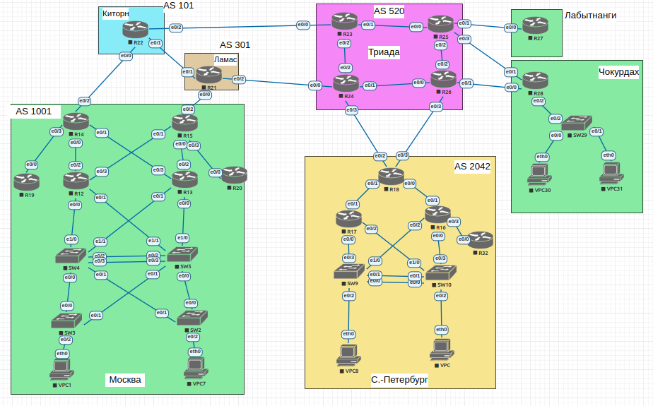
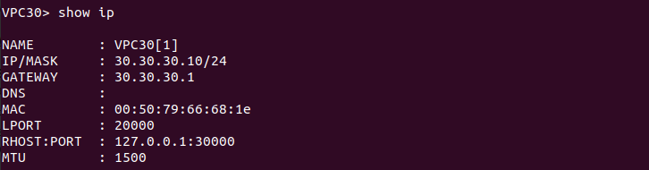
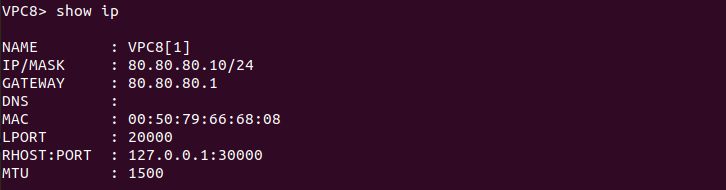
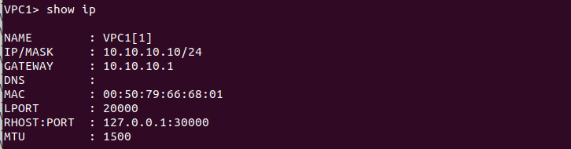
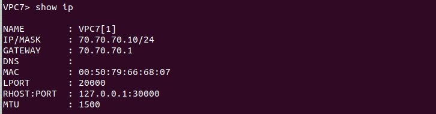

# Lab - IPv4/6

## Цель:
   В данной самостоятельной работе необходимо распланировать адресное пространство
   
   Настроить IP на всех активных портах для дальнейшей работы над проектом
   
   Адресное пространство должно быть задокументировано

## Описание/Пошаговая инструкция выполнения домашнего задания:
   Разработаете и задокументируете адресное пространство для лабораторного стенда.
   
   Настроите ip адреса на каждом активном порту
   
   Настроите каждый VPC в каждом офисе в своем VLAN.
   
   Настроите VLAN управления для сетевых устройств
   
   Настроите сети офисов так, чтобы не возникало broadcast штормов, а использование линков было максимально оптимизировано
   
   Используете ipv4 и ipv6
   

## Topology

| Офис         | IPv4-сеть      | IPv6-сеть          |
|--------------|----------------|--------------------|
| Москва       | 172.16.5.0/24  | 2001:df8:1000::/48 |
| (AS 1011)    |                |                    |
|--------------|----------------|--------------------|
| С.-Петербург | 172.16.6.0/24  | 2001:df8:1000::/48 |
| (AS 2042)    |                |                    |
|--------------|----------------|--------------------|
| Чокурдах     | 172.16.1.24/24 | 2001:df8:1000::/48 |
|              |                |                    |
|--------------|----------------|--------------------|
| Лабытнаги    | 172.16.1.24/24 | 2001:df8:1000::/48 |
|--------------|----------------|--------------------|
| Триада       | 172.16.1.24/24 | 2001:df8:1000::/48 |
| (AS 520)     |                |                    |
|--------------|----------------|--------------------| 
| Ламас        | 172.16.3.24/24 | 2001:df8:1000::/48 |
| (AS 301      |                |                    |
|--------------|----------------|--------------------|
| Киторн       | 172.16.2.24/24 | 2001:df8:1000::/48 |
| (AS 101)     |                |                    |
|--------------|----------------|--------------------|

Лыбытнаги:
| Устройство | Порт | IP-адрес                | Описание  |
|------------|------|-------------------------|-----------|
| R27        | e0/0 | 172.16.1.1/30           | R27 - R25 |
|            |      | 2001:df8:1000:f1::27/64 |           |
|            |      | fe80::27                |           |

Триада (AS 520):
| Устройство | Порт | IP-адрес                | Описание  |
|------------|------|-------------------------|-----------|
| R25        | e0/1 | 172.16.1.2/30           | R25 - R27 |
|            |      | 2001:df8:1000:f1::25/64 |           |
|            |      | fe80::25                |           |
|            | e0/0 | 172.16.1.5/30           | R25 - R23 |
|            |      | 2001:df8:1000:a1::25/64 |           |
|            |      | fe80::25                |           |
|            | e0/2 | 172.16.1.9/30           | R25 - R26 |
|            |      | 2001:df8:1000:b1::25/64 |           |
|            |      | fe80::25                |           |
|            | e0/3 | 172.16.1.13/30          | R25 - R28 |
|            |      | 2001:df8:1000:c1::25/64 |           |
|            |      | fe80::25                |           |
|------------|------|-------------------------|-----------|
| R23        | e0/0 | 172.16.1.17/30          | R23 - R22 |
|            |      | 2001:df8:1000:f1::23/64 |           |
|            |      | fe80::23                |           |
|            | e0/1 | 172.16.1.6/30           | R23 - R25 |
|            |      | 2001:df8:1000:a1::23/64 |           |
|            |      | fe80::23                |           |
|            | e0/2 | 172.16.1.21/30          | R23 - R24 |
|            |      | 2001:df8:1000:b1::23/64 |           |
|            |      | fe80::23                |           |
|------------|------|-------------------------|-----------|
| R24        | e0/0 | 172.16.1.25/30          | R24 - R21 |
|            |      | 2001:df8:1000:f1::24/64 |           |
|            |      | fe80::24                |           |
|            | e0/1 | 172.16.1.29/30          | R24 - R26 |
|            |      | 2001:df8:1000:a1::24/64 |           |
|            |      | fe80::24                |           |
|            | e0/2 | 172.16.1.22/30          | R24 - R23 |
|            |      | 2001:df8:1000:b1::24/64 |           |
|            |      | fe80::24                |           |
|            | e0/3 | 172.16.1.33/30          | R24 - R18 |
|            |      | 2001:df8:1000:c1::24/64 |           |
|            |      | fe80::24                |           |
|------------|------|-------------------------|-----------|
| R26        | e0/0 | 172.16.1.30/30          | R26 - R24 |
|            |      | 2001:df8:1000:f1::26/64 |           |
|            |      | fe80::26                |           |
|            | e0/1 | 172.16.1.37/30          | R26 - R28 |
|            |      | 2001:df8:1000:a1:26/64  |           |
|            |      | fe80::26                |           |
|            | e0/2 | 172.16.1.10/30          | R26 - R25 |
|            |      | 2001:df8:1000:b1::26/64 |           |
|            |      | fe80::26                |           |
|            | e0/3 | 172.16.1.38/30          | R26 - R18 |
|            |      | 2001:df8:1000:c1::26/64 |           |
|            |      | fe80::26                |           |

Чокурдах
| Устройство | Порт    | IP-адрес                | Описание   |
|------------|---------|-------------------------|------------|
| R28        | e0/0    | 172.16.1.38/30          | R28 - R26  |
|            |         | 2001:df8:1000:a1::28/64 |            |
|            |         | fe80::28                |            |
|            | e0/1    | 172.16.1.14/30          | R28 - R25  |
|            |         | 2001:df8:1000:f1::28/64 |            |
|            |         | fe80::28                |            |
|            | e0/0.30 | 30.30.30.1/24           | FOR_VLAN30 |
|            | e0/0.31 | 31.31.31.1/24           | FOR_VLAN3  |
|            | e0/0.50 | 50.50.50.1/24           | MGMT       |

Киторн (AS 101)
| Устройство | Порт | IP-адрес                | Описание  |
|------------|------|-------------------------|-----------|
| R22        | e0/0 | 172.16.2.1/30           | R22 - R14 |
|            |      | 2001:df8:1000:f1::22/64 |           |
|            |      | fe80::22                |           |
|            | e0/1 | 172.16.3.1/30           | R22 - R21 |
|            |      | 2001:df8:1000:a1::22/64 |           |
|            |      | fe80::22                |           |
|            | e0/2 | 172.16.1.18/30          | R22 - R23 |
|            |      | 2001:df8:1000:b1::22/64 |           |
|            |      | fe80::22                |           |

Ламас (AS 301)
| Устройство | Порт | IP-адрес                | Описание  |
|------------|------|-------------------------|-----------|
| R21        | e0/0 | 172.16.4.1/30           | R21 - R15 |
|            |      | 2001:df8:1000:f1::21/64 |           |
|            |      | fe80::21                |           |
|            | e0/1 | 172.16.3.2/30           | R21 - R22 |
|            |      | 2001:df8:1000:b1::21/64 |           |
|            |      | fe80::21                |           |
|            | e0/2 | 172.16.1.26/30          | R21 - R24 |
|            |      | 2001:df8:1000:a1::21/64 |           |
|            |      | fe80::21                |           |

С.-Петербург (AS 2042)
| Устройство | Порт | IP-адрес                | Описание    |
|------------|------|-------------------------|-------------|
| R16        | e0/1 | 172.16.6.2/30           | R16 - R18   |
|            |      | 2001:df8:1000:f1::16/64 |             |
|            |      | fe80::16                |             |
|            | e0/3 | 172.16.6.9/30           | R16 - R32   |
|            |      | 2001:df8:1000:a1::16/64 |             |
|            |      | fe80::16                |             |
|------------|------|-------------------------|-------------|
| R17        | e0/1 | 172.16.6.6/30           | R17 - R18   |
|            |      | 2001:df8:1000:f1::17/64 |             |
|            |      | fe80::17                |             |
|------------|------|-------------------------|-------------|
| R18        | e0/0 | 172.16.6.1/30           | R18 - R16   |
|            |      | 2001:df8:1000:f1::18/64 |             |
|            |      | fe80::18                |             |
|            | e0/1 | 172.16.6.5/30           | R18 - R17   |
|            |      | 2001:df8:1000:a1::18/64 |             |
|            |      | fe80::18                |             |
|            | e0/2 | 172.16.1.34/30          | R18 - R24   |
|            |      | 2001:df8:1000:b1::18/64 |             |
|            |      | fe80::18                |             |
|            | e0/  | 172.16.1.42/30          | R18 - R26   |
|            |      | 2001:df8:1000:c1::18/64 |             |
|            |      | fe80::18                |             |
|------------|------|-------------------------|-------------|
| R32        | e0/0 | 172.16.6.10/30         | R32 - R16   |
|            |      | 2001:df8:1000:f1::32/64 |             |
|            |      | fe80::32               |             |
|------------|------|------------------------|-------------|

Москва (AS 1001)
| Устройство | Порт | IP-адрес                | Описание  |
|------------|------|-------------------------|-----------|
| R12        | e0/2 | 172.16.5.2/30           | R12 - R14 |
|            |      | 2001:df8:1000:f1::12/64 |           |
|            |      | fe80::12                |           |
|            | e0/3 | 172.16.5.13/30          | R12 - R15 |
|            |      | 2001:df8:1000:b1::12/64 |           |
|            |      | fe80::12                |           |
|------------|------|-------------------------|-----------|
| R13        | e0/2 | 172.16.5.17/30          | R13 - R15 |
|            |      | 2001:df8:1000:f1::13/64 |           |
|            |      | fe80::13                |           |
|            | e0/3 | 172.16.5.10/30          | R13 - R14 |
|            |      | 2001:df8:1000:b1::13/64 |           |
|            |      | fe80::13                |           |
|------------|------|-------------------------|-----------|
| R14        | e0/0 | 172.16.5.1/30           | R14 - R12 |
|            |      | 2001:df8:1000:f1::14/64 |           |
|            |      | fe80::14                |           |
|            | e0/1 | 172.16.5.9/30           | R14 - R13 |
|            |      | 2001:df8:1000:b1::14/64 |           |
|            |      | fe80::14                |           |
|            | e0/2 | 172.16.2.2/30           | R14 - R22 |
|            |      | 2001:df8:1000:a1::14/64 |           |
|            |      | fe80::14                |           |
|            | e0/3 | 172.16.5.5/30           | R14 - R19 |
|            |      | 2001:df8:1000:c1::14/64 |           |
|            |      | fe80::14                |           |
|------------|------|-------------------------|-----------|
| R15        | e0/0 | 172.16.5.18/30          | R15 - R13 |
|            |      | 2001:df8:1000:f1::15/64 |           |
|            |      | fe80::15                |           |
|            | e0/1 | 172.16.5.14/30          | R15 - R12 |
|            |      | 2001:df8:1000:b1::15/64 |           |
|            |      | fe80::15                |           |
|            | e0/2 | 172.16.4.2/30           | R15 - R21 |
|            |      | 2001:df8:1000:a1::15/64 |           |
|            |      | fe80::15                |           |
|            | e0/3 | 172.16.5.21/30          | R15 - R20 |
|            |      | 2001:df8:1000:c1::15/64 |           |
|            |      | fe80::15                |           |
|------------|------|-------------------------|-----------|
| R19        | e0/0 | 172.16.5.6/30           | R19 - R14 |
|            |      | 2001:df8:1000:f1::19/64 |           |
|            |      | fe80::19                |           |
|------------|------|-------------------------|-----------|
| R20        | e0/0 | 172.16.5.22/30          | R20 - R15 |
|            |      | 2001:df8:1000:f1::20/64 |           |
|            |      | fe80::20                |           |
|------------|------|-------------------------|-----------|

VLAN
| Устройство | VLAN | IP-адрес               | Name          |
|------------|------|------------------------|---------------|
| VPC1       | 10   | 10.10.10.10/24         | FOR_VPC1      |
| VPC7       | 70   | 70.70.70.10/24         | FOR_VPC7      |
|------------|------|------------------------|---------------|
| VPC8       | 80   | 80.80.80.10/24         | FOR_VPC8      |
|------------|------|------------------------|---------------|
| VPC        | 100  | 100.100.100.10/24      | FOR_VPC       |
|------------|------|------------------------|---------------|
| VPC30      | 30   | 30.30.30.10/24         | FOR_VPC30     |
|------------|------|------------------------|---------------|
| VPC31      | 31   | 31.31.31.10/24         | FOR_VPC31     |
|------------|------|------------------------|---------------|
|            | 500  |                        | NATIVE        |
|------------|------|------------------------|---------------|
|            | 50   | 50.50.50.0/24          | MGMT_CH       |
|            | 51   | 51.51.51.0/24          | MGMT_SPB      |
|            | 52   | 52.52.52.0/24          | MGMT_MOS      |
|------------|------|------------------------|---------------|
|            | 999  |                        | PARKING_LOT   |
|------------|------|------------------------|---------------|

VPC
Чокурдах

С.-Петербург

Москва

