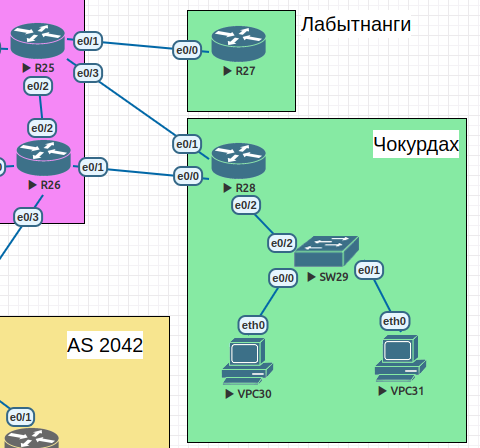
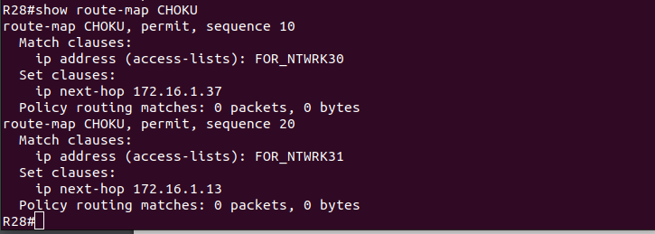
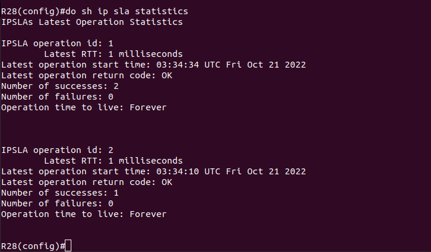

# Lab - PBR

## Цель:
   Настроить политику маршрутизации в офисе Чокурдах
   
   Распределить трафик между 2 линками


## Описание/Пошаговая инструкция выполнения домашнего задания:
   1. Настроить политику маршрутизации для сетей офиса.
   
   2. Распределить трафик между двумя линками с провайдером.
   
   3. Настроить отслеживание линка через технологию IP SLA.(только для IPv4)
   
   4. Настроить для офиса Лабытнанги маршрут по-умолчанию.
   
   5. План работы и изменения зафиксировать в документации.

## Topology



   На R28 создадим ACL и на их основе route-map для VPC-офиса Чокурдах:

```
ip access-list standard FOR_NTWRK30
permit 30.30.30.0 0.0.0.255 any
deny any
exit
ip access-list standard FOR_NTWRK31
permit 31.31.31.0 0.0.0.255 any
deny any
exit
```

```
route-map CHOKU permit 10
match ip address FOR_NTWRK30
set ip next-hop 172.16.1.37
exit
route-map CHOKU permit 20
match ip address FOR_NTWRK31
set ip next-hop 172.16.1.13
exit
int e0/2
ip policy route-map CHOKU
```



   Настроим отслеживание линка

```
ip sla 1
icmp-echo 172.16.1.14
timeout 5000
exit
ip sla schedule 1 life forever start-time now
ip sla 2
icmp-echo 172.16.1.38
timeout 5000
exit
ip sla schedule 1 life forever start-time now
```



   Настроим отслеживание SLA

```
track 1 ip sla 1 reachability
delay down 10 up 5
exit
track 2 ip sla 2 reachability
delay down 10 up 5
exit
```
   Внесем соответствующие изменения в route-map'ы

```
route-map CHOKO permit 10
match ip address FOR_NTWRK30
set ip next-hop verify-availability 172.16.1.37 1 track 1
exit
route-map CHOKO permit 20
match ip address FOR_NTWRK31
set ip next-hop verify-availability 172.16.1.13 2 track 2
exit
```

   Настроим для офиса Лабытнанги маршрут по-умолчанию
   
```
ip route 0.0.0.0 0.0.0.0 172.16.1.2
```

