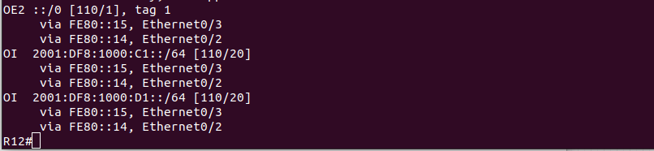

# Lab - OSPF

## Цель:
   Настроить OSPF офисе Москва
   
   Разделить сеть на зоны
   
   Настроить фильтрацию между зонами


## Описание/Пошаговая инструкция выполнения домашнего задания:
   1. Маршрутизаторы R14-R15 находятся в зоне 0 - backbone.
   
   2. Маршрутизаторы R12-R13 находятся в зоне 10. Дополнительно к маршрутам должны получать маршрут по умолчанию.
   
   3. Маршрутизатор R19 находится в зоне 101 и получает только маршрут по умолчанию.
   
   4. Маршрутизатор R20 находится в зоне 102 и получает все маршруты, кроме маршрутов до сетей зоны 101.
   
   5. Настройка для IPv6 повторяет логику IPv4.
   
   6. План работы и изменения зафиксированы в документации .

## Topology


## Зона 0 - backbone

   Так как R14 и R15 находятся в зоне backbone, то соединим их, добавив линк

### R14

   Настроим порт к R15

```
R14(config)#int e1/0
R14(config-if)#description TO_R15
R14(config-if)#ip addr 172.16.5.25 255.255.255.252
R14(config-if)#ipv6 addr 2001:df8:1000:d1::14/64
R14(config-if)#ipv6 addr fe80::14 link-local 
R14(config-if)#no shut
```

   Зададим маршрут по умолчанию

```
R14(config)#ip route 0.0.0.0 0.0.0.0 172.16.2.1
R14(config)#ipv6 route ::/0 2001:df8:1000:f1::22
```

   Настройки зоны и распространение маршрута по умолчанию

```
R14(config)#router ospf 1
R14(config-router)#router-id 14.14.14.14
R14(config-router)#default-information originate 

R14(config)#ipv6 router ospf 1
R14(config-rtr)#router-id 14.14.14.14
R14(config-rtr)#default-information originate
R14(config-rtr)#exit
```

   Настройки интерфейсов

```
R14(config)#int e0/0
R14(config-if)#ip ospf 1 area 10
R14(config-if)#ipv6 ospf 1 area 10

R14(config-if)#int e0/1
R14(config-if)#ipv6 ospf 1 area 10
R14(config-if)#ip ospf 1 area 10  

R14(config-if)#int e0/3
R14(config-if)#ip ospf 1 area 101
R14(config-if)#ipv6 ospf 1 area 101

R14(config-if)#int e1/0
R14(config-if)#ip ospf 1 area 0
R14(config-if)#ipv6 ospf 1 area 0
```

### R15

   Настроим порт к R14
   
```
R15(config)#int e1/0
R15(config-if)#description TO_R14
R15(config-if)#ip addr 172.16.5.26 255.255.255.252
R15(config-if)#ipv6 addr 2001:df8:1000:d1::15/64
R15(config-if)#ipv6 addr fe80::15 link-local 
R15(config-if)#no shut
```

   Зададим маршрут по умолчанию

```
R15(config)#ip route 0.0.0.0 0.0.0.0 172.16.4.1   
R15(config)#ipv6 route ::/0 2001:df8:1000:f1::21
```

   Настройки зоны и распространение маршрута по умолчанию

```
R15(config)#router ospf 1
R15(config-router)#router-id 15.15.15.15
R15(config-router)#default-information originate

R15(config)#ipv6 router ospf 1
R15(config-rtr)#router-id 15.15.15.15        
R15(config-rtr)#default-information originate
```

   Настройки интерфейсов

```
R15(config)#int e0/0
R15(config-if)#ip ospf 1 area 10
R15(config-if)#ipv6 ospf 1 area 10

R15(config-if)#int e0/1
R15(config-if)#ip ospf 1 area 10  
R15(config-if)#ipv6 ospf 1 area 10

R15(config-if)#int e0/3
R15(config-if)#ip ospf 1 area 102
R15(config-if)#ipv6 ospf 1 area 102
```

## Зона 10

### R12

   Настройки зоны
   
```
R12(config)#router ospf 1
R12(config-router)#router-id 12.12.12.12
R12(config-router)#ipv6 router ospf 1
R12(config-rtr)#router-id 12.12.12.12
```

   Настройки интерфейсов

```
R12(config-if)#int e0/2         
R12(config-if)#ip ospf 1 area 10 
R12(config-if)#ipv6 ospf 1 area 10

R12(config-if)#int e0/3          
R12(config-if)#ip ospf 1 area 10  
R12(config-if)#ipv6 ospf 1 area 10
```

### R13

   Настройки зоны
   
```
R13(config)#router ospf 1
R13(config-router)#router-id 13.13.13.13
R13(config-router)#ipv6 router ospf 1   
R13(config-rtr)#router-id 13.13.13.13
```

   Настройки интерфейсов

```
R13(config-if)#int e0/2
R13(config-if)#ip ospf 1 area 10
R13(config-if)#ipv6 ospf 1 area 10

R13(config-if)#int e0/3
R13(config-if)#ip ospf 1 area 10
R13(config-if)#ipv6 ospf 1 area 10
```

## Зона 101

### R19

   Настройки зоны
   
```
R19(config)#router ospf 1
R19(config-router)#router-id 19.19.19.19

R19(config)#ipv6 router ospf 1
R19(config-rtr)#router-id 19.19.19.19
```

   Настройки интерфейсов

```
R19(config)#int e0/0
R19(config-if)#ip ospf 1 area 101
R19(config-if)#ipv6 ospf 1 area 101
```

   Настроим на R19 получение только маршрута по умолчанию:

```
R19(config)#router ospf 1
R19(config-router)#area 101 stub
R19(config-router)#ipv6 router ospf 1
R19(config-rtr)#area 101 stub
```

```
R14(config)#router ospf 1
R14(config-router)#area 101 stub no-summary
R14(config-router)#ipv6 router ospf 1
R14(config-rtr)#area 101 stub no-summary
```

## Зона 102

### R20

   Настройки зоны

```
R20(config)#router ospf 1
R20(config-router)#router 
R20(config-router)#router-id 20.20.20.20

R20(config)#ipv6 router ospf 1   
R20(config-rtr)#router-id 20.20.20.20
```

   Настройки интерфейсов

```
R20(config)#int e0/0
R20(config-if)#ip ospf 1 area 102
R20(config-if)#ipv6 ospf 1 area 102
```
   Настроим на R20 получение всех маршрутов, кроме маршрутов до сетей зоны 101:

```
R15(config)#ip prefix-list 101_YOU_WILL_NOT_PASS seq 5 deny 172.16.5.4/30
R15(config)#ip prefix-list 101_YOU_WILL_NOT_PASS seq 10 permit 0.0.0.0/0 le 32
R15(config)#ipv6 prefix-list 101_V6_YOU_WILL_NOT_PASS seq 5 deny 2001:df8:1000$
R15(config)#ipv6 prefix-list 101_V6_YOU_WILL_NOT_PASS seq 10 permit ::/0 le 128

R15(config)#router ospf 1
R15(config-router)#area 102 filter-list prefix 101_YOU_WILL_NOT_PASS in
R15(config-router)#ipv6 router ospf 1
R15(config-rtr)#area 102 filter-list prefix 101_V6_YOU_WILL_NOT_PASS in
```

## Проверяем:

### R14


### R15


### R19


### R12




### R13


### R20


