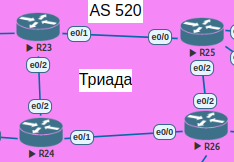
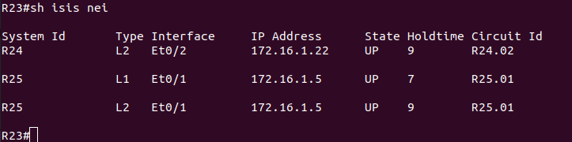
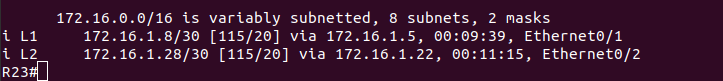
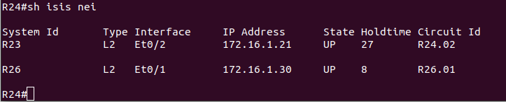
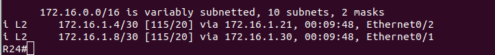
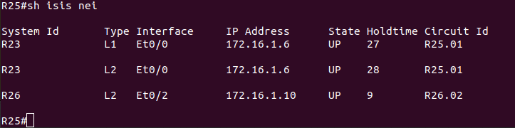
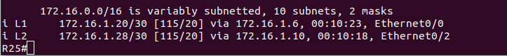
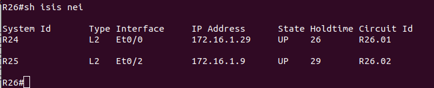
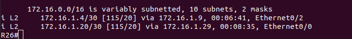

# Lab - IS-IS

## Цель:
   Настроить IS-IS офисе Триада


## Описание/Пошаговая инструкция выполнения домашнего задания:
   1. Настроите IS-IS в ISP Триада.
   
   2. R23 и R25 находятся в зоне 2222.
   
   3. R24 находится в зоне 24.
   
   4. R26 находится в зоне 26.
   
   Настройка осуществляется одновременно для IPv4 и IPv6.

## Topology



## Настройка

### R23

```
R23(config)#router isis
R23(config-router)#net 49.2222.0023.0023.0023.00
R23(config)#int range e0/1-2
R23(config-if-range)#ip router isis
R23(config-if-range)#ipv6 router isis
```

### R24

```
R24(config)#router isis
R24(config-router)#net 49.0024.0024.0024.0024.00
R24(config)#int range e0/1-2
R24(config-if-range)#ip router isis
R24(config-if-range)#ipv6 router isis
```

### R25

```
R25(config)#router isis
R25(config-router)#net 49.2222.0025.0025.0025.00
R25(config-router)#int range e0/0,e0/2
R25(config-if-range)#ip router isis
R25(config-if-range)#ipv6 router isis
```

### R26

```
R26(config)#router isis
R26(config-router)#net 49.0026.0026.0026.0026.00
R26(config)#int range e0/0,e0/2
R26(config-if-range)#ip router isis
R26(config-if-range)#ipv6 router isis
```

## Проверка
















