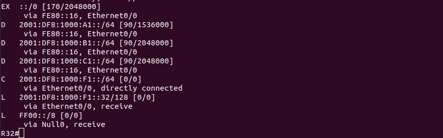

# Lab - EIRGP

## Цель:
   Настроить EIGRP в С.-Петербург;
   
   Использовать named EIGRP


## Описание/Пошаговая инструкция выполнения домашнего задания:

   1. В офисе С.-Петербург настроить EIGRP.
   
   2. R32 получает только маршрут по умолчанию.
   
   3. R16-17 анонсируют только суммарные префиксы.
   
   4. Использовать EIGRP named-mode для настройки сети.
   
   Настройка осуществляется одновременно для IPv4 и IPv6.

## Topology


## Настройка

### R18

   Добавим маршруты по умолчанию до R24 и R26

```
R18(config)#ip route 0.0.0.0 0.0.0.0 172.16.1.33
R18(config)#ipv6 route ::/0 2001:DF8:1000:C1::24
R18(config)#ip route 0.0.0.0 0.0.0.0 172.16.1.41
R18(config)#ipv6 route ::/0 2001:DF8:1000:C1::26
```

   Настроим именованый EIGRP

```
R18(config)#router ei SPB
R18(config-router)#address-family ipv4 uni autonom 1
R18(config-router-af)#eigrp router-id 18.18.18.18
R18(config-router-af)#network 172.16.6.0 0.0.0.255
R18(config-router-af)#no shut
R18(config-router-af)#af-interface e0/2
R18(config-router-af-interface)#passive-interface 
R18(config-router-af-interface)#af-interface e0/3 
R18(config-router-af-interface)#passive-interface
R18(config-router-af)#topology base 
R18(config-router-af-topology)#red stat
R18(config-router-af-topology)#exit

R18(config)#router ei SPB                    
R18(config-router)#address-family ipv6 uni autonom 1
R18(config-router-af)#eigrp router-id 18.18.18.18
R18(config-router-af)#no shut
R18(config-router-af)#af-int e0/2
R18(config-router-af-interface)#passive-interface 
R18(config-router-af-interface)#af-int e0/3       
R18(config-router-af-interface)#passive-interface 
R18(config-router-af-interface)#top base
R18(config-router-af-topology)#redist static
```

### R17

```
R17(config)#router eigrp SPB
R17(config-router)#addr ipv4 uni auto 1
R17(config-router-af)#eigrp router-id 17.17.17.17
R17(config-router-af)#network 172.16.6.0 0.0.0.255
R17(config-router-af)#af-int e0/1
R17(config-router-af-interface)#summary-addr 172.16.0.0/16
R17(config-router-af-interface)#af-int e0/0               
R17(config-router-af-interface)#passive-interface 
R17(config-router-af-interface)#af-int e0/2       
R17(config-router-af-interface)#passive-interface 
R17(config-router-af-interface)#af-int e0/3       
R17(config-router-af-interface)#passive-interface 

R17(config-router)#addr ipv6 uni auto 1        
R17(config-router-af)#eigrp router-id 17.17.17.17 
R17(config-router-af)#af-int e0/1            
R17(config-router-af-interface)#summary-addr 2001:df8:1000::/48
R17(config-router-af-interface)#af-int e0/0                    
R17(config-router-af-interface)#passive-interface              
R17(config-router-af-interface)#af-int e0/2                    
R17(config-router-af-interface)#passive-interface 
R17(config-router-af-interface)#af-int e0/3       
R17(config-router-af-interface)#passive-interface 
```


### R16

```
R16(config)#router eigrp SPB
R16(config-router)#addr ipv4 uni auto 1
R16(config-router-af)#eigrp router-id 16.16.16.16
R16(config-router-af)#network 172.16.6.0 0.0.0.255   
R16(config-router-af)#af-int e0/0
R16(config-router-af-interface)#passive-int
R16(config-router-af-interface)#af-int e0/1
R16(config-router-af-interface)#summary-addr 172.16.0.0/16
R16(config-router-af-interface)#af-int e0/2               
R16(config-router-af-interface)#passive-int               

R16(config-router)#addr ipv6 uni auto 1        
R16(config-router-af)#eigrp router-id 16.16.16.16
R16(config-router-af)#af-int e0/0
R16(config-router-af-interface)#passive-int
R16(config-router-af-interface)#af-int e0/1
R16(config-router-af-interface)#summary-addr 2001:df8:1000::/48
R16(config-router-af-interface)#af-int e0/1                    
R16(config-router-af-interface)#af-int e0/2
R16(config-router-af-interface)#passive-int                    
```


### R32

```
R32(config)#router eigrp SPB
R32(config-router)#addr ipv4 uni auto 1
R32(config-router-af)#eigrp router-id 32.32.32.32
R32(config-router-af)#network 172.16.6.0 0.0.0.255
R32(config-router-af)#no shut
R32(config-router-af)#exit
R32(config-router)#addr ipv6 uni auto 1        
R32(config-router-af)#eigrp router-id 32.32.32.32 
```





   Настроим на R32 получение только маршрута по умолчанию
   
```
R16(config)#router eigrp SPB
R16(config-router)#addr ipv4 uni auto 1
R16(config-router-af)#af-int e0/3
R16(config-router-af-interface)#summary-address 0.0.0.0 0.0.0.0

R16(config-router)#addr ipv6 uni auto 1           
R16(config-router-af)#af-int e0/3                    
R16(config-router-af-interface)#summary-address ::/0           
R16(config-router-af-interface)#
```


