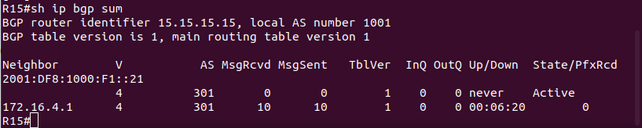
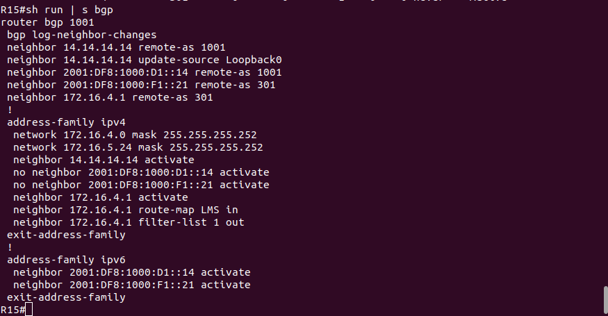

# Lab - BGP. Основы

## Цель:
   Настроить BGP между автономными системами
   
   Организовать доступность между офисами Москва и С.-Петербург

## Описание/Пошаговая инструкция выполнения домашнего задания:

   1. Настроите eBGP между офисом Москва и двумя провайдерами - Киторн и Ламас.
   
   2. Настроите eBGP между провайдерами Киторн и Ламас.
   
   3. Настроите eBGP между Ламас и Триада.
   
   4. Настроите eBGP между офисом С.-Петербург и провайдером Триада.
   
   5. Организуете IP доступность между пограничным роутерами офисами Москва и С.-Петербург.

## Topology


## Настройка

   1. Настроите eBGP между офисом Москва и двумя провайдерами - Киторн и Ламас:
   
### R22

```
R22(config)#router bgp 101
R22(config-router)#bgp router-id 22.22.22.22
R22(config-router)#neighbor 172.16.2.2 remote-as 1001
R22(config-router)#neighbor 2001:df8:1000:a1::14 remote-as 1001
R22(config-router)#address-family ipv4
R22(config-router-af)#neighbor 172.16.2.2 activate
R22(config-router-af)#neighbor 2001:df8:1000:a1::14 activate
```

### R14

```
R14(config)#router bgp 1001
R14(config-router)#bgp router-id 14.14.14.14
R14(config-router)#neighbor 172.16.2.1 remote-as 101
R14(config-router)#neighbor 2001:df8:1000:f1::22 remote-as 101
R14(config-router)#address-family ipv4
R14(config-router-af)#neighbor 172.16.2.1 activ
R14(config-router-af)#neigh 2001:df8:1000:f1::22 activ
```


### R21

```
R21(config)#router bgp 301
R21(config-router)#bgp router-id 21.21.21.21
R21(config-router)#neighbor 172.16.4.2 remote-as 1001
R21(config-router)#neighbor 2001:df8:1000:a1::15 remote-as 1001
R21(config-router)#address-fam ipv4
R21(config-router-af)#neighbor 172.16.4.2 activate
R21(config-router-af)#neighbor 2001:df8:1000:a1::15 activate
```

### R15

```
R15(config)#router bgp 1001
R15(config-router)#bgp router-id 15.15.15.15
R15(config-router)#neighbor 172.16.4.1 remote-as 301
R15(config-router)#neighbor 2001:df8:1000:f1::21 remote-as 301
R15(config-router)#address-fam ipv4
R15(config-router-af)#neighbor 172.16.4.1 activate
R15(config-router-af)#neighbor 2001:df8:1000:f1::21 activate
```




   2. Настроите eBGP между провайдерами Киторн и Ламас:
   
### R21

```
R21(config)#router bgp 301
R21(config-router)#neighbor 172.16.3.1 remote-as 101
R21(config-router)#neighbor 2001:df8:1000:a1::22 remote-as 101
R21(config-router-af)#address-fam ipv4                      
R21(config-router-af)#neighbor 172.16.3.1 activ
R21(config-router-af)#neighbor 2001:df8:1000:a1::22 activate
```

### R22

```
R22(config)#router bgp 101
R22(config-router)#neighbor 172.16.3.2 remote-as 301
R22(config-router)#neighbor 2001:df8:1000:b1::21 remote-as 301
R22(config-router-af)#address-fam ipv4
R22(config-router-af)#neighbor 172.16.3.2 activate
R22(config-router-af)#neighbor 2001:df8:1000:b1::21 activate
```


   3. Настроите eBGP между Ламас и Триада:
   
### R21

```
R21(config)#router bgp 301
R21(config-router)#neighbor 172.16.1.25 remote-as 520
R21(config-router)#neighbor 2001:df8:1000:f1::24 remote-as 520
R21(config-router-af)#address-fam ipv4
R21(config-router-af)#neighbor 172.16.1.25 activ
R21(config-router-af)#neighbor 2001:df8:1000:f1::24 activ
```

### R24

```
R24(config)#router bgp 520
R24(config-router)#bgp router-id 24.24.24.24
R24(config-router)#neighbor 172.16.1.26 remote-as 301
R24(config-router)#neighbor 2001:df8:1000:a1::21 remote-as 301
R24(config-router-af)#address-family ipv4                 
R24(config-router-af)#neighbor 172.16.1.26 activ
R24(config-router-af)#neighbor 2001:df8:1000:a1::21 activ
```


   4. Настроите eBGP между офисом С.-Петербург и провайдером Триада.
   
### R24

```
R24(config)#router bgp 520
R24(config-router)#neighbor 172.16.1.34 remote-as 2042
R24(config-router)#neighbor 2001:df8:1000:b1::18 remote-as 2042
R24(config-router-af)#address-fam ipv4                   
R24(config-router-af)#neighbor 172.16.1.34 activ
R24(config-router-af)#neighbor 2001:df8:1000:b1::18 activ
```

### R18

```
R18(config)#router bgp 2042
R18(config-router)#bgp router-id 18.18.18.18
R18(config-router)#neighbor 172.16.1.33 remote-as 520
R18(config-router)#neighbor 2001:df8:1000:c1::24 remote-as 520
R18(config-router-af)#address-fam ipv4                    
R18(config-router-af)#neighbor 172.16.1.33 activ
R18(config-router-af)#neighbor 2001:df8:1000:c1::24 activa
```


### R26

```
R26(config)#router bgp 520
R26(config-router)#bgp router-id 26.26.26.26
R26(config-router)#neighbor 172.16.1.42 remote-as 2042
R26(config-router)#neighbor 2001:df8:1000:c1::18 remote-as 2042
R26(config-router-af)#address-fam ipv4                   
R26(config-router-af)#neighbor 172.16.1.42 activ
R26(config-router-af)#neighbor 2001:df8:1000:c1::18 activ
```

### R18

```
R18(config)#router bgp 2042
R18(config-router)#neighbor 172.16.1.41 remote-as 520
R18(config-router)#neighbor 2001:df8:1000:c1::26 remote-as 520
R18(config-router-af)#address-fam ipv4                   
R18(config-router-af)#neighbor 172.16.1.41 activ 
R18(config-router-af)#neighbor 2001:df8:1000:c1::26 activ
```


   5. Организуете IP доступность между пограничным роутерами офисами Москва и С.-Петербург:
   
### R22

```
R22(config)#router bgp 101
R22(config-router)#address-fam ipv4
R22(config-router-af)#network 172.16.2.0 mask 255.255.255.252
R22(config-router-af)#address-fam ipv6
R22(config-router-af)#network 2001:df8:1000:a1::/64
```

### R21

```
R21(config)#router bgp 301
R21(config-router)#address-family ipv4
R21(config-router-af)#network 172.16.4.0 mask 255.255.255.252
R21(config-router-af)#address-family ipv6
R21(config-router-af)#network 2001:df8:1000:a1::/64
```

### R24

```
R21(config)#router bgp 520
R21(config-router)#address-family ipv4
R21(config-router-af)#network 172.16.1.32 mask 255.255.255.252
R21(config-router-af)#address-family ipv6
R21(config-router-af)#network 2001:df8:1000:b1::/64
```

   Проверяем:
   
   ping R18 - R15 и R14

 


Доработка по замечаниям:

### R14


 

### R22


### R21


### R15




   

