# Lab - BGP. Основы

## Цель:
   Настроить iBGP в офисе Москва
   
   Настроить iBGP в сети провайдера Триада
   
   Организовать полную IP связанность всех сетей

## Описание/Пошаговая инструкция выполнения домашнего задания:

   1. Настроите iBGP в офисе Москва между маршрутизаторами R14 и R15.
   
   2. Настроите iBGP в провайдере Триада, с использованием RR.
   
   3. Настройте офис Москва так, чтобы приоритетным провайдером стал Ламас.
   
   4. Настройте офис С.-Петербург так, чтобы трафик до любого офиса распределялся по двум линкам одновременно.
   
   5. Все сети в лабораторной работе должны иметь IP связность.

## Topology

### Москва

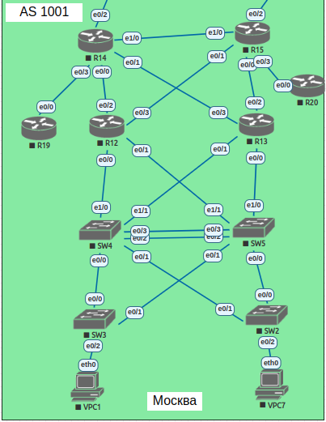

### Триада

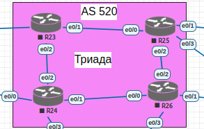

## Настройка

   1. Настроите iBGP в офисе Москва между маршрутизаторами R14 и R15.

   Так как на R14 и R15 уже настроен и OSPF и BGP, то просто добавим loopback интерфейсы и добавим необходимые правила в настройки протоколов маршрутизации:

### R14

```
R14(config)#int lo0
R14(config-if)#ip address 14.14.14.14 255.255.255.255
R14(config-if)#ip ospf 1 area 0
```

```
R14(config)#router bgp 1001
R14(config-router)#neighbor 15.15.15.15 remote-as 1001
R14(config-router)#neighbor 15.15.15.15 update-source lo0
```

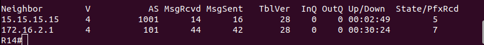

### R15

```
R15(config)#int lo0
R15(config-if)#ip addr 15.15.15.15 255.255.255.255
R15(config-if)#ip ospf 1 area 0
```

```
R15(config)#router bgp 1001
R15(config-router)#neighbor 14.14.14.14 remote-as 1001
R15(config-router)#neighbor 14.14.14.14 update-source lo0
```

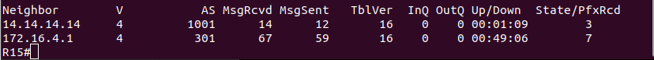

   2. Настроите iBGP в провайдере Триада, с использованием RR.

   Аналогичным образом поднимем loopback-интерфейсы и настроим iBGP.

### R23 - RR-Server

```
R23(config-if)#ip addr 23.23.23.23 255.255.255.255
R23(config-if)#ip router isis

R23(config)#router bgp 520
R23(config-router)#bgp router-id interface Loopback0
R23(config-router)#bgp log-neighbor-changes
R23(config-router)#neighbor RR_TRD peer-group
R23(config-router)#neighbor RR_TRD remote-as 520
R23(config-router)#neighbor RR_TRD update-source lo0
R23(config-router)#neighbor RR_TRD route-reflector-client
R23(config-router)#neighbor 24.24.24.24 peer-group RR_TRD
R23(config-router)#neighbor 25.25.25.25 peer-group RR_TRD
R23(config-router)#neighbor 26.26.26.26 peer-group RR_TRD
```

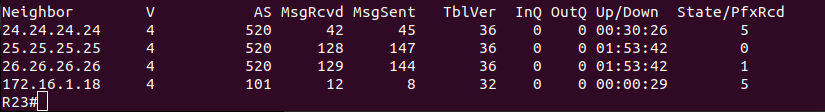

### R24

```
R24(config)#int lo0
R24(config-if)#ip addr 24.24.24.24 255.255.255.255
R24(config-if)#ip router isis

R24(config)#router bgp 520
R24(config-router)#neighbor 23.23.23.23 remote-as 520
R24(config-router)#neighbor 23.23.23.23 update-source lo0
R24(config-router)#neighbor 23.23.23.23 next-hop-self    
```

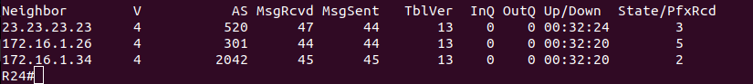

### R25

```
R25(config)#int lo0
R25(config-if)#ip addr 25.25.25.25
R25(config-if)#ip router isis

R25(config)#router bgp 520
R25(config-router)#bgp router-id int lo0
R25(config-router)#neighbor 23.23.23.23 remote-as 520
R25(config-router)#neighbor 23.23.23.23 update-      
R25(config-router)#neighbor 23.23.23.23 update-source lo0
R25(config-router)#neighbor 23.23.23.23 next-hop-self    
```

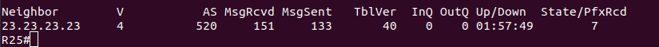

### R26

```
R26(config)#int lo0
R26(config-if)#ip addr 26.26.26.26 255.255.255.255
R26(config-if)#ip router isis

R26(config)#router bgp 520
R26(config-router)#neighbor 23.23.23.23 remote-as 520
R26(config-router)#neighbor 23.23.23.23 update-sourc 
R26(config-router)#neighbor 23.23.23.23 update-source lo0
R26(config-router)#neighbor 23.23.23.23 next-hop-self    
```

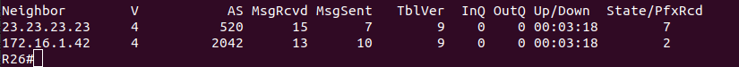

   3. Настройте офис Москва так, чтобы приоритетным провайдером стал Ламас.
   
   Трассировка с R14 до R18:

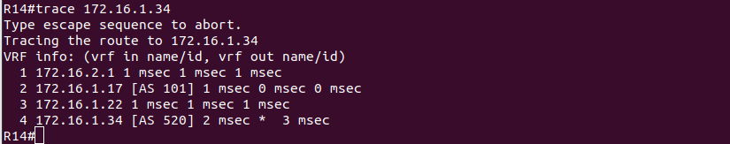
   
   Изменим Local Preference:

```
route-map LMS permit 10
set local-preference 250
route-map LMS deny 1000

router bgp 1001
neighbor 172.16.4.1 route-map LMS in
neighbor 2001:DF8:1000:F1::21 route-map LMS in
```

   Трассировка с R14 до R18 после изменения:

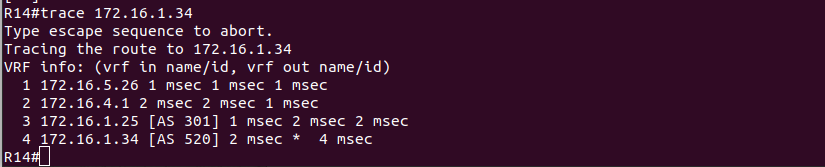
   
   4. Настройте офис С.-Петербург так, чтобы трафик до любого офиса распределялся по двум линкам одновременно.
   
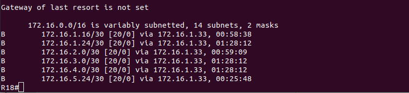
   
```
R18(config)#router bgp 2042
R18(config-router)#maximum-paths 2
R18(config-router)#bgp bestpath as-path multipath-relax
```

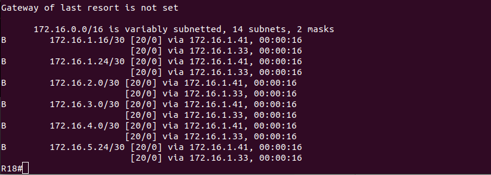

   5. Все сети в лабораторной работе должны иметь IP связность.

### R14 - R22

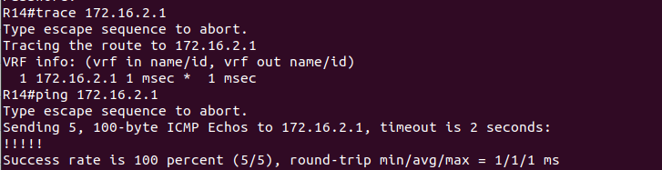

### R14 - R21

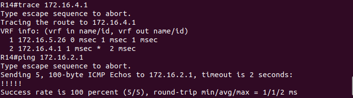

### R14 - R23

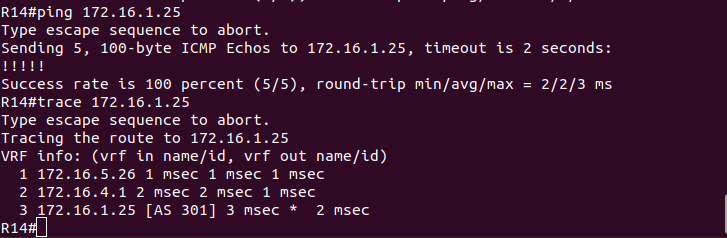

### R14 - R18

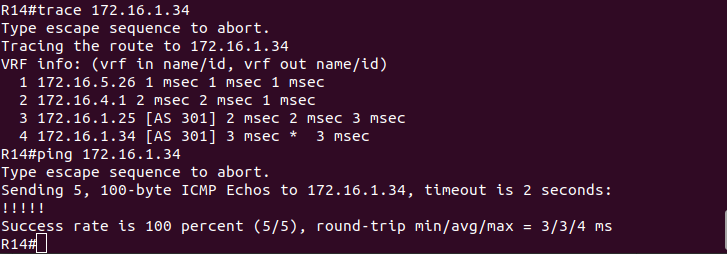

### R14 - R27

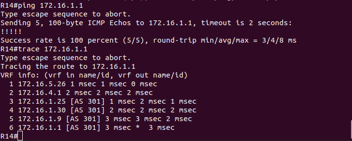

### R14 - R28

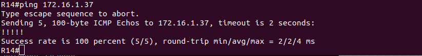
