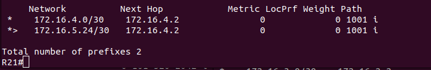
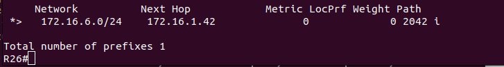

# Lab - BGP. Основы

## Цель:

   Настроить фильтрацию для офиса Москва
   
   Настроить фильтрацию для офиса С.-Петербург

## Описание/Пошаговая инструкция выполнения домашнего задания:

   1. Настроить фильтрацию в офисе Москва так, чтобы не появилось транзитного трафика(As-path).
   
   2. Настроить фильтрацию в офисе С.-Петербург так, чтобы не появилось транзитного трафика(Prefix-list).
   
   3. Настроить провайдера Киторн так, чтобы в офис Москва отдавался только маршрут по умолчанию.
   
   4. Настроить провайдер Ламас так, чтобы в офис Москва отдавался только маршрут по умолчанию и префикс офиса С.-Петербург.
   
   5. Все сети в лабораторной работе должны иметь IP связность.

## Настройка

   1. Настроим фильтрацию в офисе Москва так, чтобы не появилось транзитного трафика(As-path)
   
   Т.к. приоритетный провайдер для Москвы - Ламас, то фильтрацию нужно делать на R15:




   Транзитного трафика нет

```
R15(config)#ip as-path access-list 1 permit ^$
R15(config)#ip as-path access-list 1 deny .*  
R15(config)#router bgp 1001
R15(config-router)#neighbor 172.16.4.1 filter-list 1 out
```


   На всякий случай повторим процедуру на R14


   
```
R14(config)#ip as-path access-list 1 permit ^$
R14(config)#ip as-path access-list 1 deny .*  
R14(config)#router bgp 1001
R14(config-router)#neighbor 172.16.2.1 filter-list 1 out
```

   2. Настроим фильтрацию в офисе С.-Петербург так, чтобы не появилось транзитного трафика(Prefix-list):


```
R18(config)#ip prefix-list SPB seq 5 permit 172.16.6.0/24
R18(config)#router bgp 2042
R18(config-router)#neighbor 172.16.1.33 prefix-list SPB out
R18(config-router)#neighbor 172.16.1.41 prefix-list SPB out
```




   3. Настроим провайдера Киторн так, чтобы в офис Москва отдавался только маршрут по умолчанию:

```
R22(config)#ip prefix-list KTRN_DFLT deny 0.0.0.0/0
R22(config)#router bgp 101
R22(config-router)#neighbor 172.16.2.2 default-originate
R22(config-router)#neighbor 172.16.2.2 prefix-list KTRN_DFLT out
R22(config-router)#end
```


   4. Настроим провайдер Ламас так, чтобы в офис Москва отдавался только маршрут по умолчанию и префикс офиса С.-Петербург:
   
```
R21(config)#ip prefix-list 1 seq 5 permit 172.16.6.0/24
R21(config)#router bgp 301
R21(config-router)#neighbor 172.16.4.2 default-originate
R21(config-router)#neighbor 172.16.4.2 prefix-list 1 out
```


   5. Все сети в лабораторной работе должны иметь IP связность.

### R14 - R22


### R14 - R21


### R14 - R23


### R14 - R18


### R14 - R27


   
### R14 - R28


