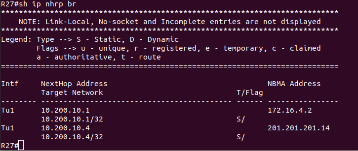

# Lab - VPN. GRE. DmVPN

## Цель:

   Настроить GRE между офисами Москва и С.-Петербург
   
   Настроить DMVPN между офисами Москва и Чокурдах, Лабытнанги

## Описание/Пошаговая инструкция выполнения домашнего задания:
   
   В этой самостоятельной работе мы ожидаем, что вы самостоятельно:

   1. Настроите GRE между офисами Москва и С.-Петербург.
   
   2. Настроите DMVMN между Москва и Чокурдах, Лабытнанги.
   
   3. Все узлы в офисах в лабораторной работе должны иметь IP связность.
   
   4. План работы и изменения зафиксированы в документации.

## Настройка

   1. GRE MSK - SPB
   
### R15

```
R15(config)#int lo2
R15(config-if)#ip addr 201.201.201.15 255.255.255.255

R15(config)#int tun0
R15(config-if)#ip addr 10.100.10.1 255.255.255.252
R15(config-if)#ip mtu 1400
R15(config-if)#ip tcp adjust-mss 1360
R15(config-if)#tun source 201.201.201.15
R15(config-if)#tun dest 201.201.201.18

R15(config)#ip route 80.80.80.0 255.255.255.0 tunnel 0
R15(config)#ip route 100.100.100.0 255.255.255.0 tunnel 0
```

### R14

```
R14(config)#int lo2
R14(config-if)#ip addr 201.201.201.14 255.255.255.255

R14(config)#int tun 1
R14(config-if)#ip addr 10.100.10.5 255.255.255.252
R14(config-if)#ip mtu 1400
R14(config-if)#ip tcp adjust-mss 1360
R14(config-if)#tun source 201.201.201.14
R14(config-if)#tun dest 201.201.201.18

R14(config)#ip route 80.80.80.0 255.255.255.0 tun 1
R14(config)#ip route 100.100.100.0 255.255.255.0 tun 1
```

### R18

```
R18(config)#int lo 2
R18(config-if)#ip addr 201.201.201.18 255.255.255.255

/*R15*/
R18(config-if)#int tun0
R18(config-if)#ip addr 10.100.10.2 255.255.255.252
R18(config-if)#ip mtu 1400
R18(config-if)#ip tcp adjust-mss 1360
R18(config-if)#tun source 201.201.201.18
R18(config-if)#tun dest 201.201.201.15  
R18(config)#ip route 30.30.30.0 255.255.255.0 tunnel 0
R18(config)#ip route 31.31.31.0 255.255.255.0 tunnel 0

/*R14*/
R18(config)#int tun 1
R18(config-if)#ip addr 10.100.10.6 255.255.255.252
R18(config-if)#ip mtu 1400
R18(config-if)#ip tcp adjust-mss 1360
R18(config-if)#tun source 201.201.201.18
R18(config-if)#tun dest 201.201.201.14
R18(config)#ip route 30.30.30.0 255.255.255.0 tunnel 1 10
R18(config)#ip route 31.31.31.0 255.255.255.0 tunnel 1 10
```


   2. DMVPN MSK - Лабытнаги - Чокурдах

### R15

```
R15(config)#int tun1
R15(config-if)#ip addr 10.200.10.1 255.255.255.0
R15(config-if)#ip mtu 1400
R15(config-if)#ip tcp adjust-mss 1360
R15(config-if)#ip nhrp map multicast dynamic 
R15(config-if)#ip nhrp network-id 1
R15(config-if)#ip nhrp redirect
R15(config-if)#tunnel source 172.16.4.2 
R15(config-if)#tun mod gre mult
R15(config-if)#ip ospf net point-to-multipoint 
R15(config-if)#ip ospf 1 area 0
```

### R14

```
R14(config)#int tun 2
R14(config-if)#ip 
R14(config-if)#ip addr 10.200.10.4 255.255.255.0
R14(config-if)#ip mtu 1400
R14(config-if)#ip tcp adjust-mss 1360
R14(config-if)#ip nhrp network-id 1
R14(config-if)#ip nhrp redirect      
R14(config-if)#tun source lo2
R14(config-if)#ip ospf net point-to-mult
R14(config-if)#ip ospf 1 area 0
R14(config-if)#ip nhrp map mult dyn
R14(config-if)#tun mode gre mult
```

### R27

```
/*R15*/
R27(config)#int tun 1
R27(config-if)#ip addr 10.200.10.2 255.255.255.0
R27(config-if)#ip mtu 1400
R27(config-if)#ip tcp adjust-mss 1360
R27(config-if)#ip nhrp map 10.200.10.1 201.201.201.15
R27(config-if)#ip nhrp map multicast 201.201.201.15 
R27(config-if)#ip nhrp network-id 1
R27(config-if)#ip nhrp nhs 10.200.10.1
R27(config-if)#ip nhrp short
R27(config-if)#tun source 172.16.1.1
R27(config-if)#tun mod gre mult
R27(config-if)#ip ospf network point-to-mult
R27(config-if)#ip ospf 1 area 0

/*R14*/
R27(config)#int tun 1
R27(config-if)#ip nhrp map 10.200.10.4 201.201.201.14
R27(config-if)#ip nhrp map mult 201.201.201.14
R27(config-if)#ip nhrp nhs 10.200.10.4
```

### R28

```
/*R15*/
R28(config)#int tun 1
R28(config-if)#ip addr 10.200.10.3 255.255.255.0
R28(config-if)#ip mtu 1400
R28(config-if)#ip tcp adjust-mss 1360
R28(config-if)#ip nhrp map 10.200.10.1 172.16.4.2
R28(config-if)#ip nhrp map multicast 172.16.4.2  
R28(config-if)#ip nhrp network-id 1
R28(config-if)#ip nhrp nhs 10.200.10.1
R28(config-if)#ip ospf network point-to-mult
R28(config-if)#ip ospf 1 area 0
R28(config-if)#tun source 172.16.1.14
R28(config-if)#tun mod gre mult

/*R14*/
R27(config)#int tun 1
R28(config-if)#ip nhrp map 10.200.10.4 201.201.201.14
R28(config-if)#ip nhrp map mult 201.201.201.14
R28(config-if)#ip nhrp nhs 10.200.10.4
```





# UPDATE

### R14

```
interface Loopback2
 ip address 201.201.201.14 255.255.255.255
!
interface Tunnel1
 ip address 10.100.10.5 255.255.255.252
 ip mtu 1400
 ip tcp adjust-mss 1360
 tunnel source 201.201.201.14
 tunnel destination 201.201.201.18
!
interface Tunnel2
 ip address 10.200.10.4 255.255.255.0
 no ip redirects
 ip mtu 1400
 ip nhrp network-id 1
 ip nhrp redirect
 ip tcp adjust-mss 1360
 ip ospf network point-to-multipoint
 ip ospf 1 area 0
 tunnel source Loopback2
 tunnel mode gre multipoint
```


### R15

```
interface Loopback2
 ip address 201.201.201.15 255.255.255.255
!
interface Tunnel0
 ip address 10.100.10.1 255.255.255.252
 ip mtu 1400
 ip tcp adjust-mss 1360
 tunnel source 201.201.201.15
 tunnel destination 201.201.201.18
!
interface Tunnel1
 ip address 10.200.10.1 255.255.255.0
 no ip redirects
 ip mtu 1400
 ip nhrp network-id 1
 ip nhrp redirect
 ip tcp adjust-mss 1360
 ip ospf network point-to-multipoint
 ip ospf 1 area 0
 tunnel source 172.16.4.2
 tunnel mode gre multipoint
```


### R18

```
interface Loopback0
 ip address 18.18.18.18 255.255.255.255
!
interface Loopback2
 ip address 201.201.201.18 255.255.255.255
!
interface Tunnel0
 ip address 10.100.10.2 255.255.255.252
 ip mtu 1400
 ip tcp adjust-mss 1360
 tunnel source 201.201.201.18
 tunnel destination 201.201.201.18
!
interface Tunnel1
 ip address 10.100.10.6 255.255.255.252
 ip mtu 1400
 ip tcp adjust-mss 1360
 tunnel source 201.201.201.18
 tunnel destination 201.201.201.14
```


### R27

```
interface Tunnel1
 ip address 10.200.10.2 255.255.255.0
 no ip redirects
 ip mtu 1400
 ip nhrp map 10.200.10.1 172.16.4.2
 ip nhrp map multicast 172.16.4.2
 ip nhrp map 10.200.10.4 201.201.201.14
 ip nhrp map multicast 201.201.201.14
 ip nhrp network-id 1
 ip nhrp nhs 10.200.10.1
 ip nhrp nhs 10.200.10.4
 ip tcp adjust-mss 1360
 tunnel source 172.16.1.1
 tunnel mode gre multipoint
```


### R28

```
interface Tunnel1
 ip address 10.200.10.3 255.255.255.0
 no ip redirects
 ip mtu 1400
 ip nhrp map multicast 172.16.4.2
 ip nhrp map 10.200.10.4 201.201.201.14
 ip nhrp map multicast 201.201.201.14
 ip nhrp map 10.200.10.1 172.16.4.2
 ip nhrp network-id 1
 ip nhrp nhs 10.200.10.4
 ip nhrp nhs 10.200.10.1
 ip tcp adjust-mss 1360
 tunnel source 172.16.1.38
 tunnel mode gre multipoint
```


