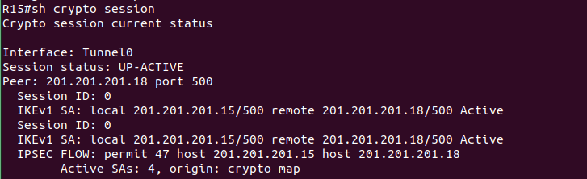
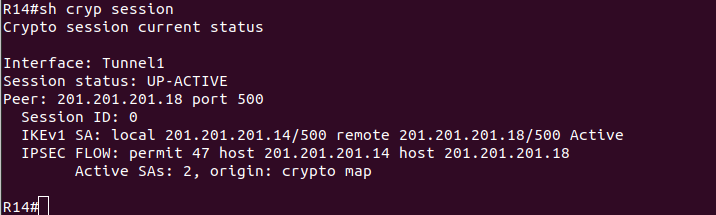
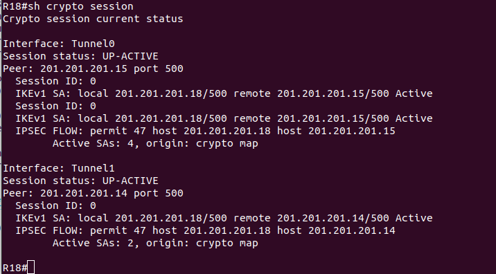
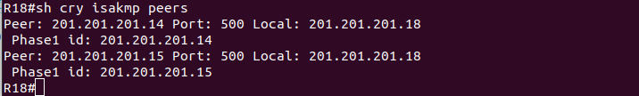
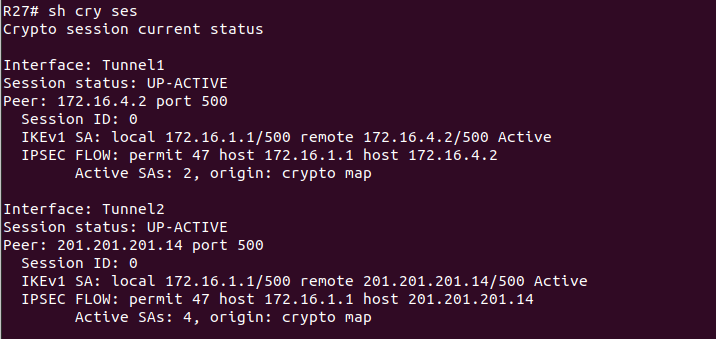
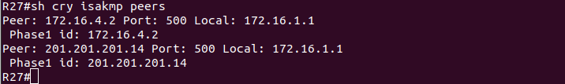
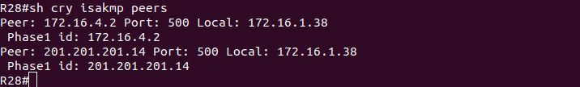
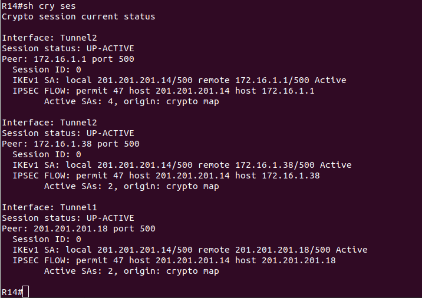
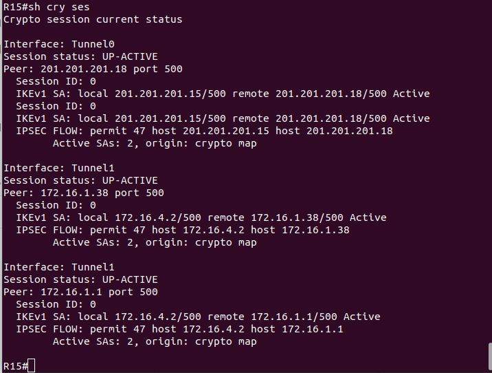

# Lab - IPSec over DmVPN

## Цель:

   Настроить GRE поверх IPSec между офисами Москва и С.-Петербург
   
   Настроить DMVPN поверх IPSec между офисами Москва и Чокурдах, Лабытнанги

## Описание/Пошаговая инструкция выполнения домашнего задания:
   
   В этой самостоятельной работе мы ожидаем, что вы самостоятельно:

   1. Настроите GRE поверх IPSec между офисами Москва и С.-Петербург.
   
   2. Настроите DMVPN поверх IPSec между Москва и Чокурдах, Лабытнанги.
   
   3. Все узлы в офисах в лабораторной работе должны иметь IP связность.
   
   4. План работы и изменения зафиксированы в документации.
   
   Дополнительно: Для IPSec использовать CA и сертификаты.

## Настройка

### R15

```
R15(config)#crypto isakmp policy 1
R15(config-isakmp)#encr aes
R15(config-isakmp)#authent pre-share       
R15(config-isakmp)#group 2
R15(config-isakmp)#crypt isa key PASSWD addr 201.201.201.18

R15(config)#crypto ipsec transform-set GRE-TSET esp-aes esp-sha-hmac
R15(cfg-crypto-trans)#mode transport

R15(cfg-crypto-trans)#crypto ipsec prof GRE-PROF
R15(ipsec-profile)#set transform-set GRE-TSET

R15(ipsec-profile)#int tun 0
R15(config-if)#tun prot ipsec prof GRE-PROF
```

### R18

```
R18(config)#crypto isakmp policy 1
R18(config-isakmp)# encr aes
R18(config-isakmp)# authentication pre-share
R18(config-isakmp)# group 2
R18(config-isakmp)#crypto isakmp key PASSWD address 201.201.201.15

R18(config)#crypto ipsec transform-set GRE-TSET esp-aes esp-sha-hmac 
R18(cfg-crypto-trans)# mode transport

R18(cfg-crypto-trans)#crypto ipsec profile GRE-PROF
R18(ipsec-profile)# set transform-set GRE-TSET

R18(ipsec-profile)#int tun 0
R18(config-if)#tunnel protection ipsec profile GRE-PROF
```




### R14

```
R14(config)#crypto isakmp policy 1
R14(config-isakmp)#encr aes
R14(config-isakmp)#authent pre-share       
R14(config-isakmp)#group 2
R14(config-isakmp)#crypt isa key PASSWD addr 201.201.201.18

R14(config)#crypto ipsec transform-set GRE-TSET esp-aes esp-sha-hmac
R14(cfg-crypto-trans)#mode transport

R14(cfg-crypto-trans)#crypto ipsec prof GRE-PROF
R14(ipsec-profile)#set transform-set GRE-TSET

R14(ipsec-profile)#int tun 0
R14(config-if)#tun prot ipsec prof GRE-PROF
```




### R18

```
R18(config)#crypto isakmp policy 1
R18(config-isakmp)#crypto isakmp key PASSWD address 201.201.201.15
```





### R27






### R28




### R14



### R15


