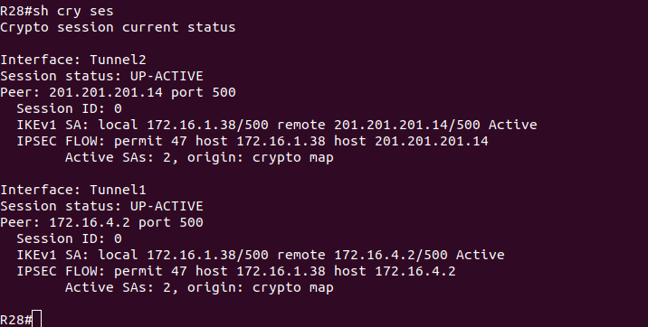

# Lab - IPSec over DmVPN

## Цель:

   Настроить GRE поверх IPSec между офисами Москва и С.-Петербург
   
   Настроить DMVPN поверх IPSec между офисами Москва и Чокурдах, Лабытнанги

## Описание/Пошаговая инструкция выполнения домашнего задания:
   
   В этой самостоятельной работе мы ожидаем, что вы самостоятельно:

   1. Настроите GRE поверх IPSec между офисами Москва и С.-Петербург.
   
   2. Настроите DMVPN поверх IPSec между Москва и Чокурдах, Лабытнанги.
   
   3. Все узлы в офисах в лабораторной работе должны иметь IP связность.
   
   4. План работы и изменения зафиксированы в документации.
   
   Дополнительно: Для IPSec использовать CA и сертификаты.

## Настройка IPSec

### R15

```
R15(config)#crypto isakmp policy 1
R15(config-isakmp)#encr aes
R15(config-isakmp)#authent pre-share       
R15(config-isakmp)#group 2
R15(config-isakmp)#crypt isa key PASSWD addr 201.201.201.18

R15(config)#crypto ipsec transform-set GRE-TSET esp-aes esp-sha-hmac
R15(cfg-crypto-trans)#mode transport

R15(cfg-crypto-trans)#crypto ipsec prof GRE-PROF
R15(ipsec-profile)#set transform-set GRE-TSET

R15(ipsec-profile)#int tun 0
R15(config-if)#tun prot ipsec prof GRE-PROF
```

### R18

```
R18(config)#crypto isakmp policy 1
R18(config-isakmp)# encr aes
R18(config-isakmp)# authentication pre-share
R18(config-isakmp)# group 2
R18(config-isakmp)#crypto isakmp key PASSWD address 201.201.201.15

R18(config)#crypto ipsec transform-set GRE-TSET esp-aes esp-sha-hmac 
R18(cfg-crypto-trans)# mode transport

R18(cfg-crypto-trans)#crypto ipsec profile GRE-PROF
R18(ipsec-profile)# set transform-set GRE-TSET

R18(ipsec-profile)#int tun 0
R18(config-if)#tunnel protection ipsec profile GRE-PROF
```


### R14

```
R14(config)#crypto isakmp policy 1
R14(config-isakmp)#encr aes
R14(config-isakmp)#authent pre-share       
R14(config-isakmp)#group 2
R14(config-isakmp)#crypt isa key PASSWD addr 201.201.201.18

R14(config)#crypto ipsec transform-set GRE-TSET esp-aes esp-sha-hmac
R14(cfg-crypto-trans)#mode transport

R14(cfg-crypto-trans)#crypto ipsec prof GRE-PROF
R14(ipsec-profile)#set transform-set GRE-TSET

R14(ipsec-profile)#int tun 0
R14(config-if)#tun prot ipsec prof GRE-PROF
```


### R18

```
R18(config)#crypto isakmp policy 1
R18(config-isakmp)#crypto isakmp key PASSWD address 201.201.201.15
```


### R27


### R28




### R14


### R15


## Настройка CA и сертификатов

### R15

```
R15(config)#ip domain-name otus.lab
R15(config)#ip http server
R15(config)#$generate rsa general-keys label CA exportable modulus 2048      

R15(config)#crypto pki server CA
R15(cs-server)#no shut
```


### R27

```
R27(config)#crypto key generate rsa label VPN
The name for the keys will be: VPN
Choose the size of the key modulus in the range of 360 to 4096 for your
  General Purpose Keys. Choosing a key modulus greater than 512 may take
  a few minutes.

How many bits in the modulus [512]: 2048
% Generating 2048 bit RSA keys, keys will be non-exportable...
[OK] (elapsed time was 2 seconds)
```

```
R27(config)#crypto pki trustpoint VPN
R27(ca-trustpoint)#enrollment url http://172.16.4.2
R27(ca-trustpoint)#subject-name CN=R27,OU=VPN,O=OTUS,C=RU 
R27(ca-trustpoint)#rsakeypair VPN
R27(ca-trustpoint)#revocation-check none

R27(config)#crypto pki authenticate VPN
Certificate has the following attributes:
       Fingerprint MD5: D43B142E 483BD6F1 E2F27553 3C43136A 
      Fingerprint SHA1: 1EDC1656 9E231538 C18ECB0D D30014BA F1211FC0 

% Do you accept this certificate? [yes/no]: yes
Trustpoint CA certificate accepted.
R27(config)#
```

```
R27(config)#crypto pki enroll VPN
%
% Start certificate enrollment .. 
% Create a challenge password. You will need to verbally provide this
   password to the CA Administrator in order to revoke your certificate.
   For security reasons your password will not be saved in the configuration.
   Please make a note of it.

Password: 
Re-enter password: 

% The subject name in the certificate will include: CN=R27,OU=VPN,O=OTUS,C=RU
% The subject name in the certificate will include: R27
% Include the router serial number in the subject name? [yes/no]: no
% Include an IP address in the subject name? [no]: no
Request certificate from CA? [yes/no]: yes
% Certificate request sent to Certificate Authority
% The 'show crypto pki certificate verbose VPN' commandwill show the fingerprint.

R27(config)#
*Feb 21 03:03:02.988: CRYPTO_PKI:  Certificate Request Fingerprint MD5: 8F5F4424 9E45AAA0 53291AEC 0C18125B 
*Feb 21 03:03:02.988: CRYPTO_PKI:  Certificate Request Fingerprint SHA1: 40AFB242 9E93F3E1 56878225 1E0369A5 B5C3EDB3 
R27(config)#
```


## RESUME

   Далее необходимо изменить политику
   
```
crypto isakmp policy 10
  authentication rsa-sig 
```
